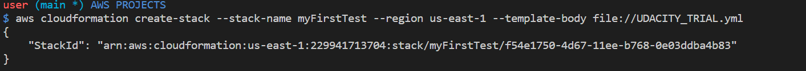
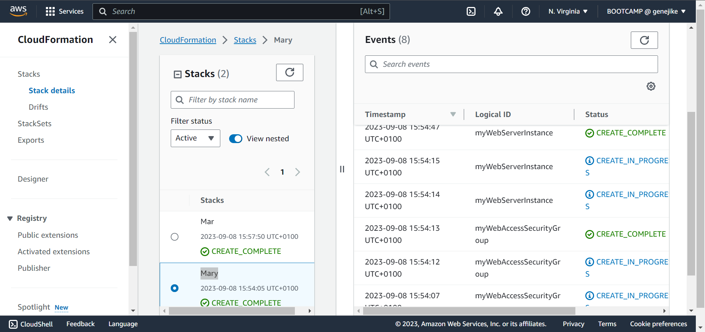

* Deploy script or upload template to aws 
```
aws cloudformation create-stack --stack-name Mar --region us-east-1 --template-body file:/s-east-1 --temps-east-1 --template-body file://UDACITY_TRIAL.yml 

```





* To delete stack

```
aws cloudformation delete-stack --stack-name Mar 

```