# DOCUMENTATION OF PROJECT-5
## IMPLEMENTING A CLIENT SERVER ARCHITECTURE USING MYSQL DATABASE MANAGEMENT SYSTEM (DBMS)
### AWS instance setup
Create and configure two Linux-based virtual servers (EC2 instances in AWS).
You can use any linux-based server -here im using ubuntu 22.04 LTS
click on launch instance and input the name of the instance . Remember to select a key pair and security group or create a new one if you dont have one.

Server A name - `mysql server`
Server B name - `mysql client`

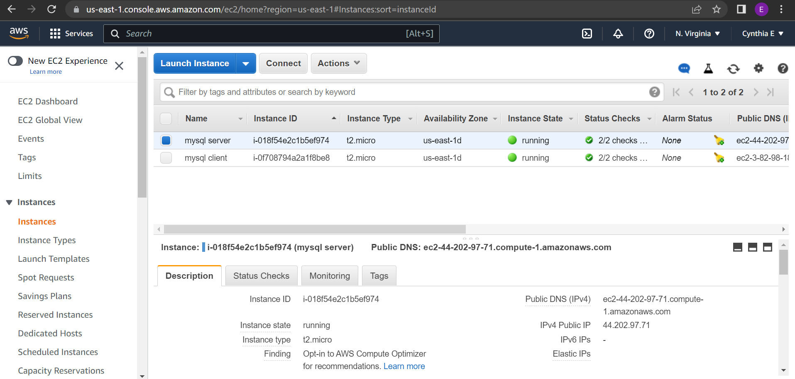

Connect to your virtual machine using a terminal 

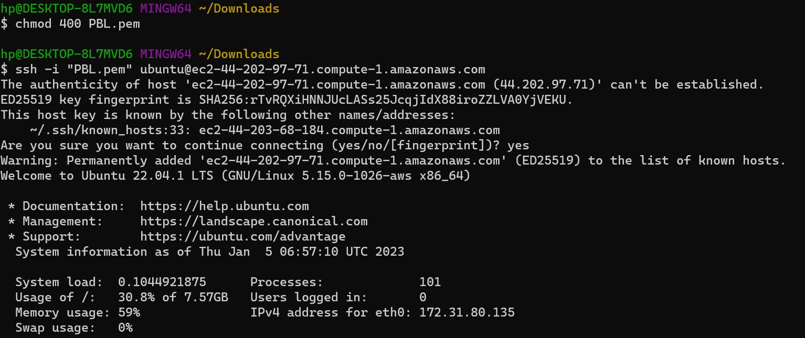

## Install MYSQL Server software

### On mysql server Linux Server install MySQL Server software.

1.Update system repositories

`sudo apt update`

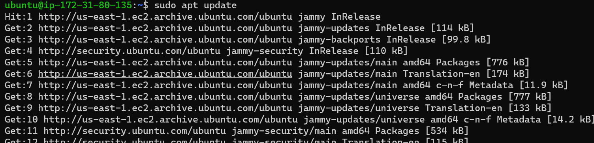
2.install my sql server 

`sudo apt-get install mysql-server`

3.Verify MySQL service status

`systemctl is-active mysql`

4.Configure MySQL server

`sudo mysql`

`ALTER USER 'root'@'localhost' IDENTIFIED WITH mysql_native_password by 'mynewpassword';`

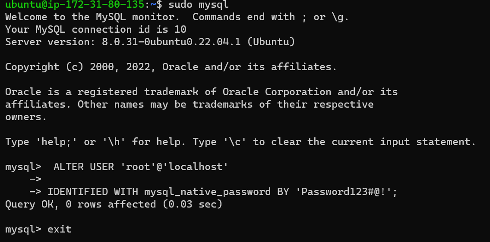

you can replace mynewpassword with any password of your choice

`sudo mysql_secure_installation`

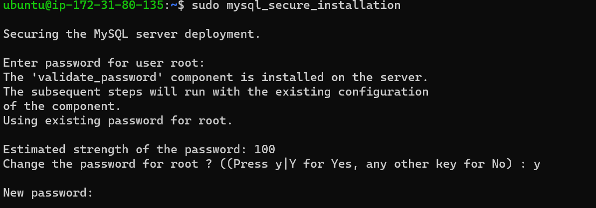
Type Y when prompted then ENTER 

5.login into the sql terminal

`sudo mysql -p`

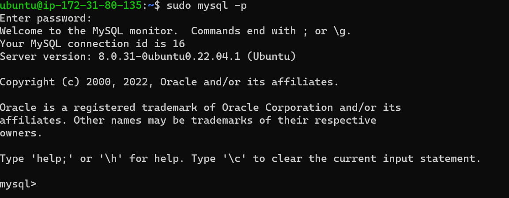

### In the MySQL server create a user and a database

Lets create an example-database and an example-user

`CREATE DATABASE TestDB1; `

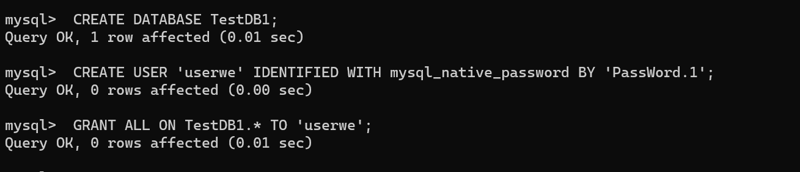  

`CREATE USER 'userwe' IDENTIFIED WITH mysql_native_password BY 'PassWord.1';`

The following command above creates a new user named userwe, using mysql_native_password as default authentication method. We’re defining this user’s password as password, but replace this value with a secure password of your own choice.
Give this user permission over the example_database database:

`GRANT ALL ON TestDB1.* TO 'userwe';`

This will give the user full privileges over the TestDB1 database, while preventing this user from creating or modifying other databases on your server.

To exit the sql 

`mysql> exit`

To test if this user has proper logging ability

`mysql-u userwe -p`

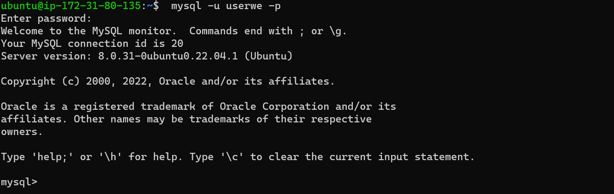

confirm that you have access to the TestDB1 database: 
`SHOW DATABASES;`

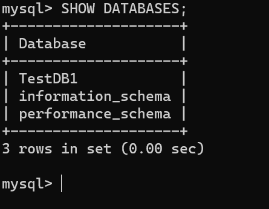

You might need to configure MySQL server to allow connections from remote hosts.

`sudo vi /etc/mysql/mysql.conf.d/mysqld.cnf`

Replace ‘127.0.0.1’ to ‘0.0.0.0’ like this:

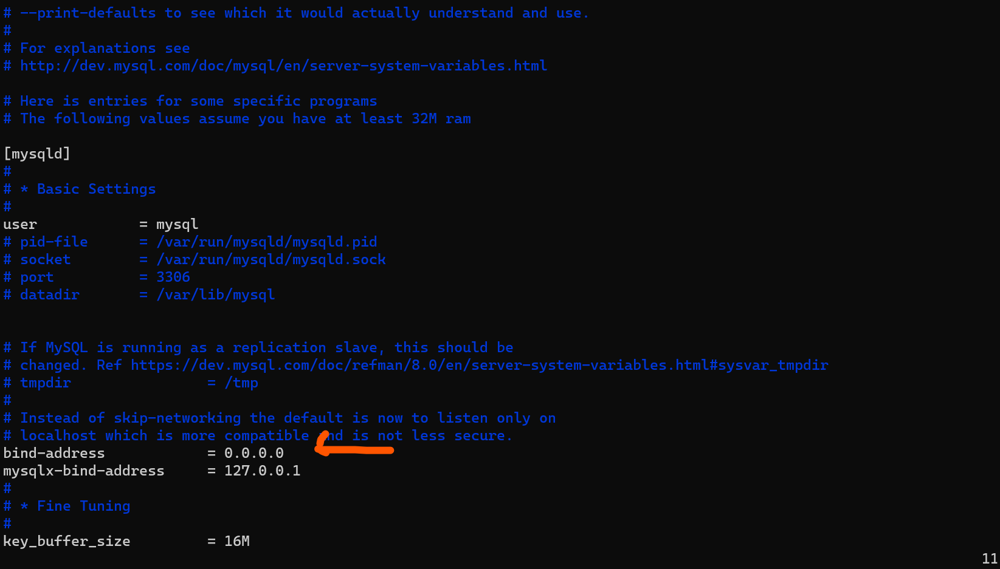

Exit MySQL and restart the mySQL service using

`sudo service mysql restart`

check mysqlstatus

`sudo systemctl status mysql.service`

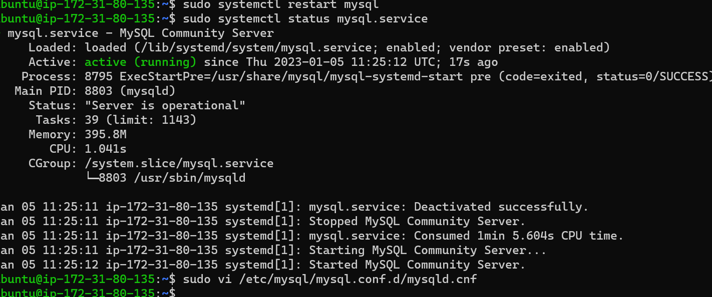
### On mysql client Linux Server install MySQL Client software.

1.Update system repositories

`sudo apt update`
`sudo apt upgrade`

2.install my sql client 

`sudo apt-get install mysql-client`

From mysql client Linux Server connect remotely to mysql server Database Engine without using SSH. You must use the mysql utility to perform this action.
By default, both of your EC2 virtual servers are located in the same local virtual network, so they can communicate to each other using local IP addresses. Use mysql server's local IP address to connect from mysql client. MySQL server uses TCP port 3306 by default, so you will have to open it by creating a new entry in ‘Inbound rules’ in ‘mysql server’ Security Groups.For extra security

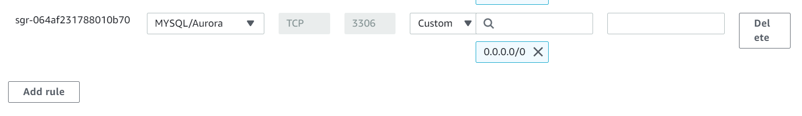

From mysql client instance connect remotely to mysql server Database using:

`sudo mysql -u userexample -h <mysqlserver private ip> -p`

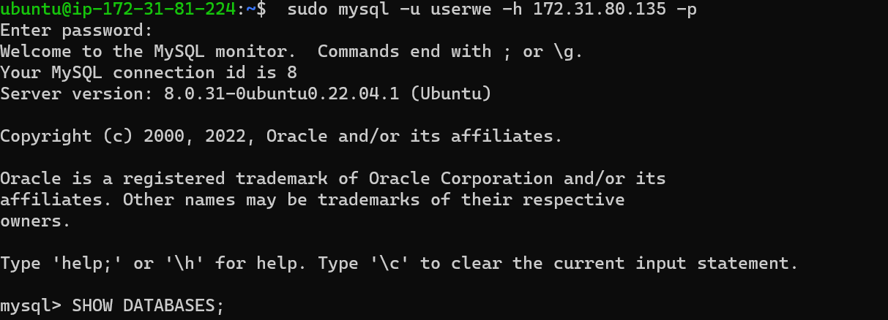

TEST:
SHOW DATABASES;
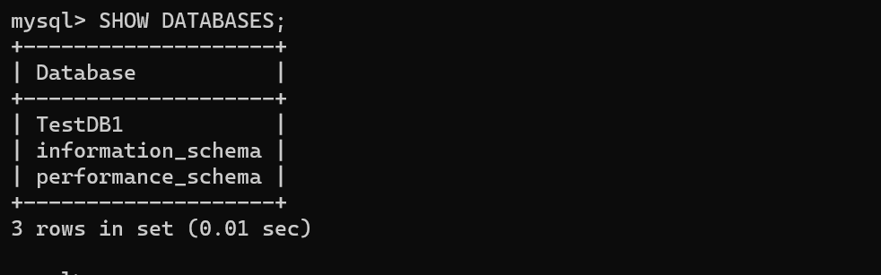
 
IT WORKS!!!!