# DOCUMENTATIONOF PROJECT-6
## A WEB SOLUTION WITH WORDPRESS
In this project we are tasked to prepare a storage infrastructure on two Linux servers and implement a basic web solution using WordPress. WordPress is a free and open-source content management system written in PHP and paired with MySQL or MariaDB as its backend Relational Database Management System (RDBMS).
Project 6 consists of two parts:
Configure storage subsystem for Web and Database servers based on Linux OS. The focus of this part is to give you practical experience of working with disks, partitions and volumes in Linux.
Install WordPress and connect it to a remote MySQL database server. This part of the project will solidify your skills of deploying Web and DB tiers of Web solution.

we are going to do this in 2 parts :
1.Configure storage subsystem for Web and Database servers based on Linux OS. The focus of this part is to give you practical experience of working with disks, partitions and volumes in Linux.
2.Install WordPress and connect it to a remote MySQL database server. This part of the project will solidify your skills of deploying Web and DB tiers of Web solution.

Three-tier Architecture is a client-server software architecture pattern that comprise of 3 separate layers.

Presentation Layer (PL): This is the user interface such as the client server or browser on your laptop.

Business Layer (BL): This is the backend program that implements business logic. Application or Webserver

Data Access or Management Layer (DAL): This is the layer for computer data storage and data access. Database Server or File System Server such as FTP server, or NFS Server

Your 3-Tier Setup

1.A Laptop or PC to serve as a client
2.An EC2 Linux Server as a web server (This is where you will install WordPress)
3.An EC2 Linux server as a database (DB) server
   
In this project we are using REDHAT OSinstead of ubuntu
## AWS SETUP
### LAUNCH AN EC2 INSTANCE THAT WILL SERVE AS “WEB SERVER”

Spin up an EC2 instanse on AWS
Note: for Ubuntu server, when connecting to it via SSH/Putty or any other tool, we used ubuntu user, but for RedHat you will need to use ec2-user user. Connection string will look like ec2-user@<Public-IP>
### Step 1 — Prepare a Web Server
Launch an EC2 instance that will serve as "Web Server".

Create 3 volumes in the same AZ as your Web Server EC2, each of 10 GiB.

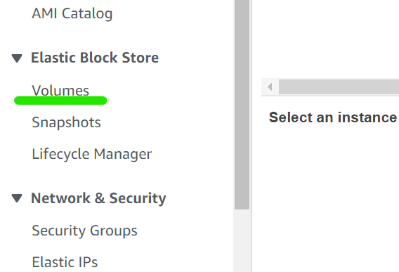
click on create volume and the drop down will show.make show to select 10 GiB and the availability zone should be the same as your web server Then click create

After creating attach to your webserver 

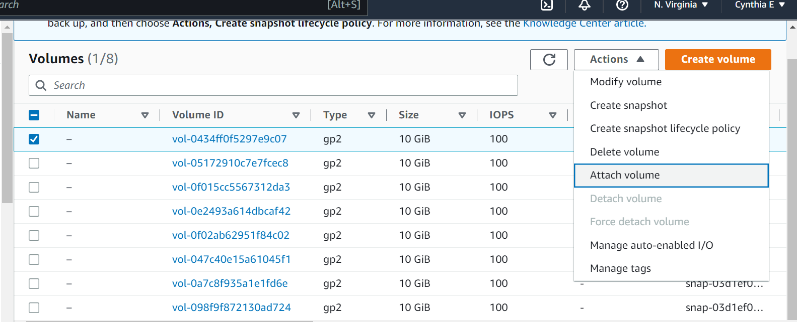
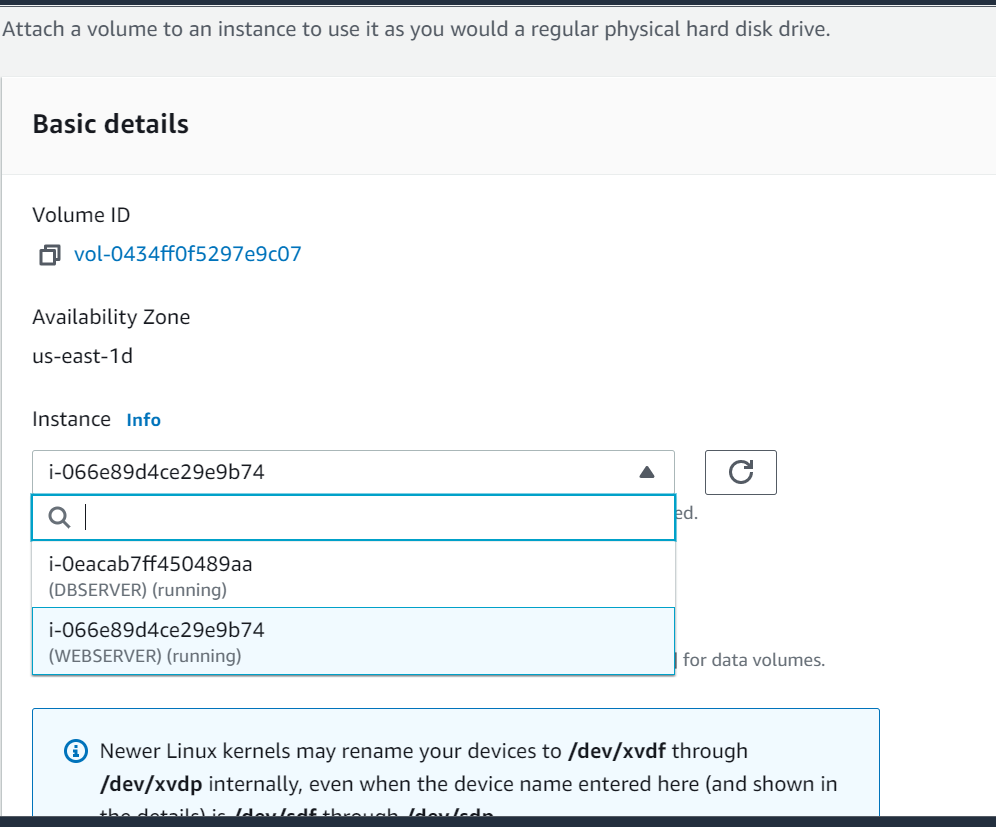

Do this for all 3 volumes

Open up the Linux terminal to begin configuration

Use `lsblk` command to inspect what block devices are attached to the server. Notice names of your newly created devices. All devices in Linux reside in `/dev/` directory. Inspect it with `ls /dev/` and make sure you see all 3 newly created block devices there – their names will likely be `xvdf, xvdh, xvdg`.

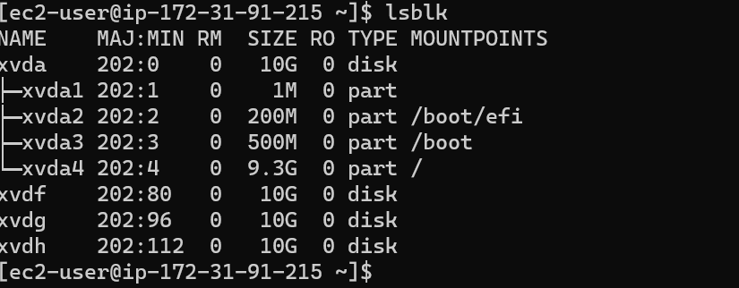
Use`df -h` command to see all mounts and free space on your server

Use `gdisk` utility to create a single partition on each of the 3 disks

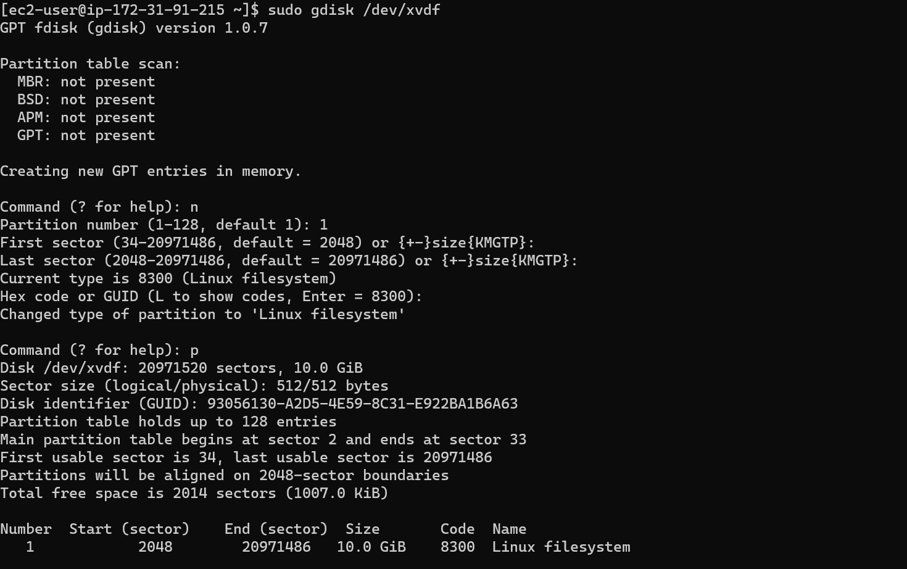

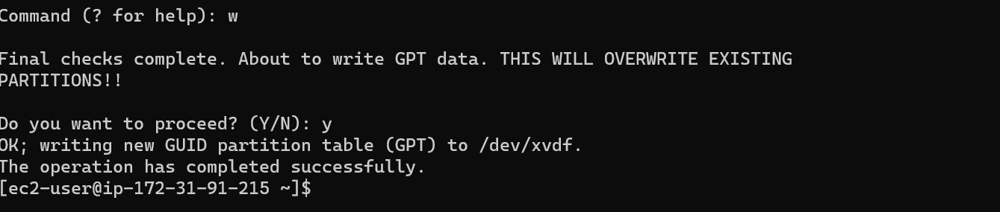

Use `lsblk` utility to view the newly configured partition on each of the 3 disks.

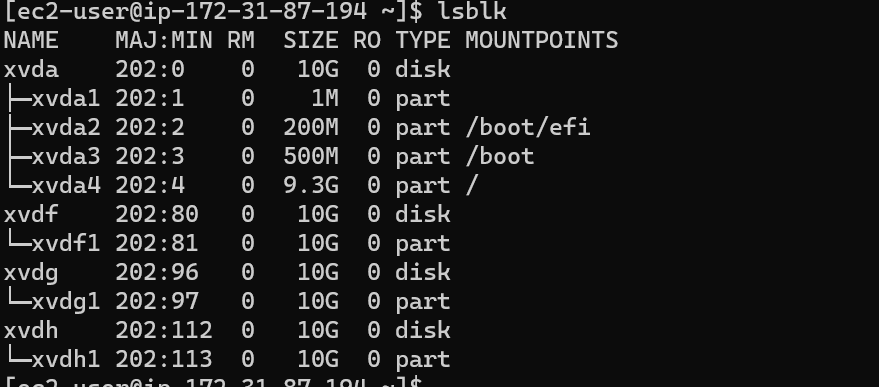

Install lvm2 package using `sudo yum install lvm2`. 

Run `sudo lvmdiskscan` command to check for available partitions.

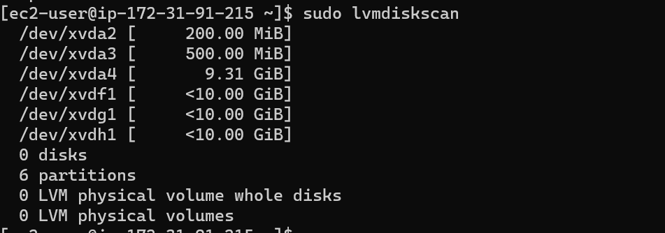

Note: Previously, in Ubuntu we used apt command to install packages, in RedHat/CentOS a different package manager is used, so we shall use yum command instead.

Use `pvcreate` utility to mark each of 3 disks as physical volumes (PVs) to be used by LVM

`sudo pvcreate /dev/xvdf1`
`sudo pvcreate /dev/xvdg1`
`sudo pvcreate /dev/xvdh1`

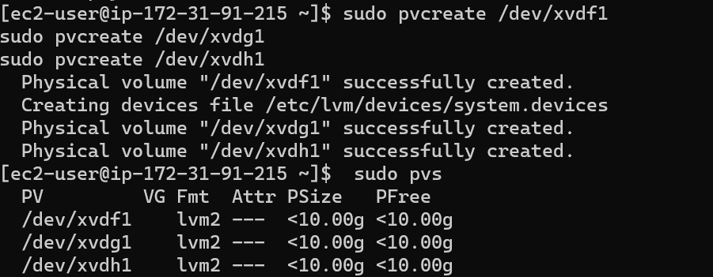

Use `vgcreate` utility to add all 3 PVs to a volume group (VG). Name the VG webdata-vg

`sudo vgcreate webdata-vg /dev/xvdh1 /dev/xvdg1 /dev/xvdf1`

Verify that your VG has been created successfully by running

`sudo vgs`

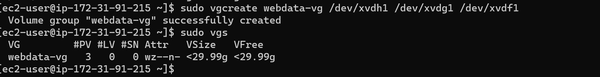

Use `lvcreate` utility to create 2 logical volumes. apps-lv (Use half of the PV size), and logs-lv Use the remaining space of the PV size. 
NOTE: apps-lv will be used to store data for the Website while, logs-lv will be used to store data for logs.

`sudo lvcreate -n apps-lv -L 14G webdata-vg`
`sudo lvcreate -n logs-lv -L 14G webdata-vg`

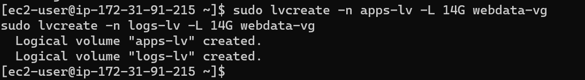
Verify that your Logical Volume has been created successfully by running 

`sudo lvs`

Verify the entire setup
 
`sudo vgdisplay -v #view complete setup - VG, PV, and LV`
`sudo lsblk `

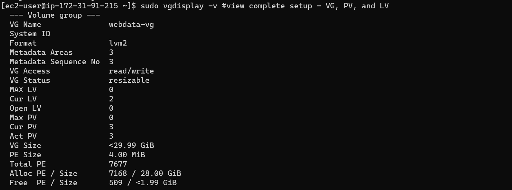

Use `mkfs.ext4` to format the logical volumes with ext4 filesystem

`sudo mkfs -t ext4 /dev/webdata-vg/apps-lv`
`sudo mkfs -t ext4 /dev/webdata-vg/logs-lv`

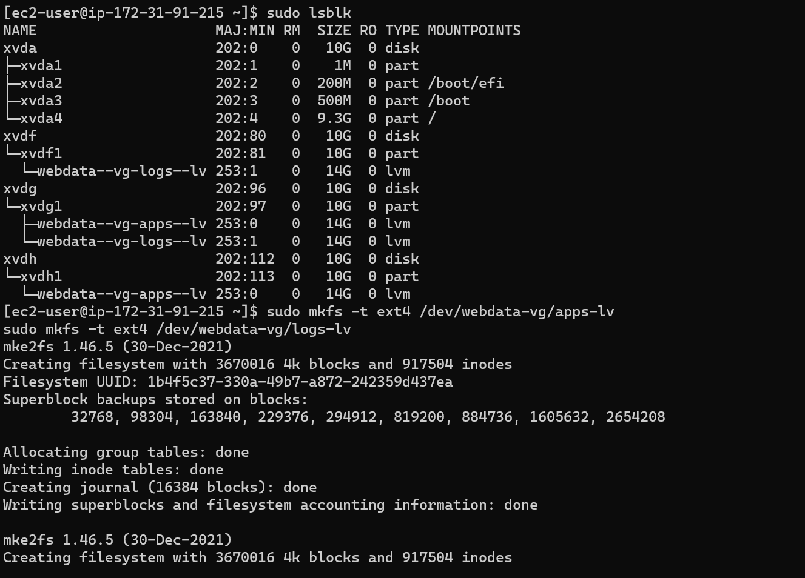

Create /var/www/html directory to store website files
 
`sudo mkdir -p /var/www/html`

Create /home/recovery/logs to store backup of log data
 
`sudo mkdir -p /home/recovery/logs`

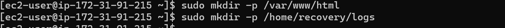

Mount /var/www/html on apps-lv logical volume
 
`sudo mount /dev/webdata-vg/apps-lv /var/www/html/`
 

Use rsync utility to back up all the files in the log directory /var/log into /home/recovery/logs (This is required before mounting the file system)
 
`sudo rsync -av /var/log/. /home/recovery/logs/`
Mount /var/log on logs-lv logical volume. (Note that all the existing data on /var/log will be deleted. That is why step 15 above is very
important)

`sudo mount /dev/webdata-vg/logs-lv /var/log`

Restore log files back into /var/log directory

 

`sudo rsync -av /home/recovery/logs/. /var/log`

  
Update /etc/fstab file so that the mount configuration will persist after restart of the server.

### UPDATE THE `/ETC/FSTAB` FILE

The UUID of the device will be used to update the /etc/fstab file;

`sudo blkid`

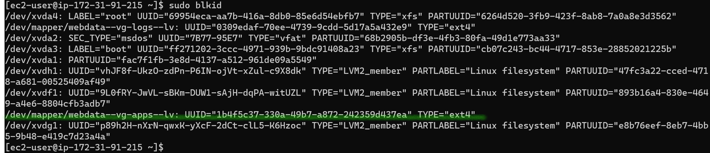

`sudo vi /etc/fstab`

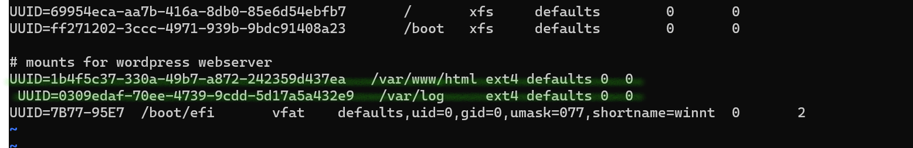
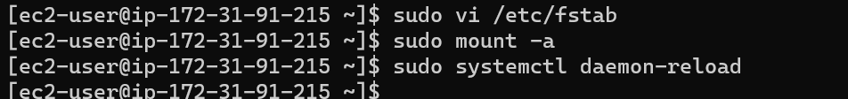

