# DOCUMENTATIONOF PROJECT-6
## A WEB SOLUTION WITH WORDPRESS
In this project we are tasked to prepare a storage infrastructure on two Linux servers and implement a basic web solution using WordPress. WordPress is a free and open-source content management system written in PHP and paired with MySQL or MariaDB as its backend Relational Database Management System (RDBMS).
Project 6 consists of two parts:
Configure storage subsystem for Web and Database servers based on Linux OS. The focus of this part is to give you practical experience of working with disks, partitions and volumes in Linux.
Install WordPress and connect it to a remote MySQL database server. This part of the project will solidify your skills of deploying Web and DB tiers of Web solution.

we are going to do this in 2 parts :
1.Configure storage subsystem for Web and Database servers based on Linux OS. The focus of this part is to give you practical experience of working with disks, partitions and volumes in Linux.
2.Install WordPress and connect it to a remote MySQL database server. This part of the project will solidify your skills of deploying Web and DB tiers of Web solution.

Three-tier Architecture is a client-server software architecture pattern that comprise of 3 separate layers.

Presentation Layer (PL): This is the user interface such as the client server or browser on your laptop.

Business Layer (BL): This is the backend program that implements business logic. Application or Webserver

Data Access or Management Layer (DAL): This is the layer for computer data storage and data access. Database Server or File System Server such as FTP server, or NFS Server

Your 3-Tier Setup

1.A Laptop or PC to serve as a client
2.An EC2 Linux Server as a web server (This is where you will install WordPress)
3.An EC2 Linux server as a database (DB) server
   
In this project we are using REDHAT OSinstead of ubuntu
## AWS SETUP
### LAUNCH AN EC2 INSTANCE THAT WILL SERVE AS “WEB SERVER”

Spin up an EC2 instanse on AWS
Note: for Ubuntu server, when connecting to it via SSH/Putty or any other tool, we used ubuntu user, but for RedHat you will need to use ec2-user user. Connection string will look like ec2-user@<Public-IP>
### Step 1 — Prepare a Web Server
Launch an EC2 instance that will serve as "Web Server".

Create 3 volumes in the same AZ as your Web Server EC2, each of 10 GiB.

click on create volume and the drop down will show.make show to select 10 GiB and the availability zone should be the same as your web server Then click create

After creating attach to your webserver 

Do this for all 3 volumes

Open up the Linux terminal to begin configuration

Use `lsblk` command to inspect what block devices are attached to the server. Notice names of your newly created devices. All devices in Linux reside in `/dev/` directory. Inspect it with `ls /dev/` and make sure you see all 3 newly created block devices there – their names will likely be `xvdf, xvdh, xvdg`.

Use`df -h` command to see all mounts and free space on your server

Use `gdisk` utility to create a single partition on each of the 3 disks

`sudo gdisk /dev/xvdf`

For the partition number click 1 then for the first sector and last sector because we are using the whole space we click enter
then because we are using lvm we change to the partition type 8E00

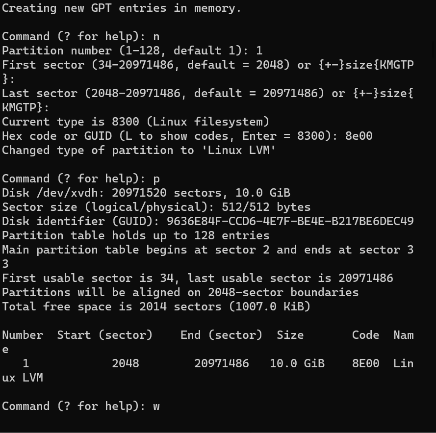

repeat this steps for

`sudo gdisk /dev/xvdg`

and

`sudo gdisk /dev/xvdh`

Use `lsblk` utility to view the newly configured partition on each of the 3 disks.

Install lvm2 package using

`sudo yum install lvm2`. 

Run `sudo lvmdiskscan` command to check for available partitions.

Note: Previously, in Ubuntu we used apt command to install packages, in RedHat/CentOS a different package manager is used, so we shall use yum command instead.

Use `pvcreate` utility to mark each of 3 disks as physical volumes (PVs) to be used by LVM

`sudo pvcreate /dev/xvdf1`
`sudo pvcreate /dev/xvdg1`
`sudo pvcreate /dev/xvdh1`

Use `vgcreate` utility to add all 3 PVs to a volume group (VG). Name the VG webdata-vg

`sudo vgcreate webdata-vg /dev/xvdh1 /dev/xvdg1 /dev/xvdf1`

Verify that your VG has been created successfully by running

`sudo vgs`

Use `lvcreate` utility to create 2 logical volumes. apps-lv (Use half of the PV size), and logs-lv Use the remaining space of the PV size. 
NOTE: apps-lv will be used to store data for the Website while, logs-lv will be used to store data for logs.

`sudo lvcreate -n apps-lv -L 14G webdata-vg`
`sudo lvcreate -n logs-lv -L 14G webdata-vg`

Verify that your Logical Volume has been created successfully by running 

`sudo lvs`

Verify the entire setup
 
`sudo vgdisplay -v #view complete setup - VG, PV, and LV`
`sudo lsblk `

Use `mkfs.ext4` to format the logical volumes with ext4 filesystem

`sudo mkfs -t ext4 /dev/webdata-vg/apps-lv`
`sudo mkfs -t ext4 /dev/webdata-vg/logs-lv`

Create /var/www/html directory to store website files
 
`sudo mkdir -p /var/www/html`

Create /home/recovery/logs to store backup of log data
 
`sudo mkdir -p /home/recovery/logs`

Mount /var/www/html on apps-lv logical volume
 
`sudo mount /dev/webdata-vg/apps-lv /var/www/html/`
 

Use rsync utility to back up all the files in the log directory /var/log into /home/recovery/logs (This is required before mounting the file system)
 
`sudo rsync -av /var/log/. /home/recovery/logs/`
Mount /var/log on logs-lv logical volume. (Note that all the existing data on /var/log will be deleted. That is why step 15 above is very
important)

`sudo mount /dev/webdata-vg/logs-lv /var/log`

Restore log files back into /var/log directory

 

`sudo rsync -av /home/recovery/logs/. /var/log`

  
Update /etc/fstab file so that the mount configuration will persist after restart of the server.

### UPDATE THE `/ETC/FSTAB` FILE

The UUID of the device will be used to update the /etc/fstab file;

`sudo blkid`

`sudo vi /etc/fstab`

Verify your setup by running `df -h`, output must look like this:

### Step 2 — Prepare the Database Server
Launch a second RedHat EC2 instance that will have a role – ‘DB Server’
Repeat the same steps as for the Web Server, but instead of `apps-lv` create `db-lv` and mount it to `/db` directory instead of `/var/www/html/`.

Attach all three volumes one by one to your Wdatabase server EC2 instance

Use lsblk command to inspect what block devices are attached to the server. 
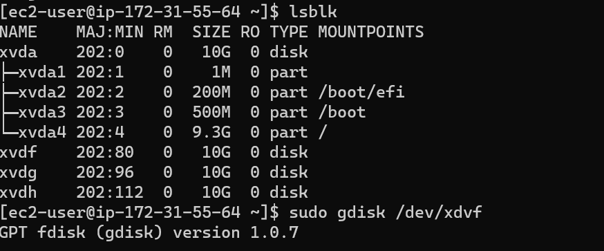

Use `df -h` command to see all mounts and free space on your server

repeat for all disk partition

Install lvm2 package using 

`sudo yum install lvm2`

Run `sudo lvmdiskscan` command to check for available partitions.

Use pvcreate utility to mark each of 3 disks as physical volumes (PVs) to be used by LVM

`sudo pvcreate /dev/xvdf1`
`sudo pvcreate /dev/xvdg1`
`sudo pvcreate /dev/xvdh1`

Verify that your Physical volume has been created successfully by running 

`sudo pvs`

Use vgcreate utility to add all 3 PVs to a volume group (VG). Name the VG vg-database

`sudo vgcreate vg-database /dev/xvdh1 /dev/xvdg1 /dev/xvdf1`

Verify that your VG has been created successfully by running 

`sudo vgs`

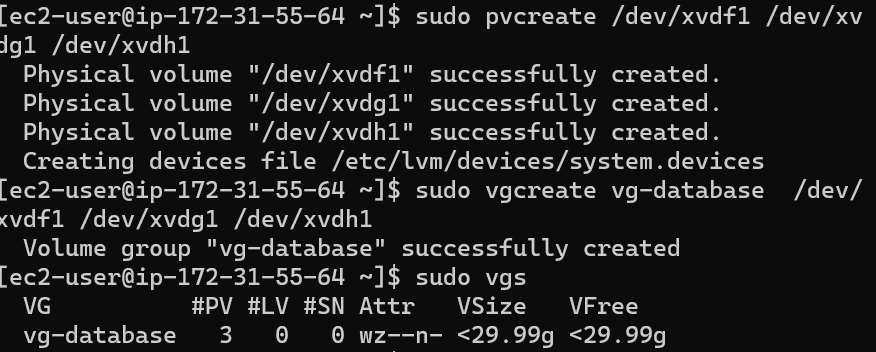

Use `lvcreate` utility to create a logical volumes.

`sudo lvcreate -n db-lv -L 20G vg-database`
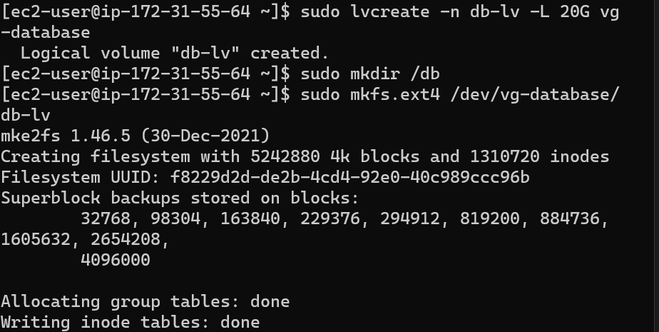

Verify that your Logical Volume has been created successfully by running

`sudo lvs`

`sudo vgdisplay -v` 

#view complete setup - VG, PV, and LV

sudo `lsblk `

Create /db directory to store database files

`sudo mkdir /db`

Use mkfs.ext4 to format the logical volumes with ext4 filesystem

`sudo mkfs.ext4 /dev/vg-database/db-lv`
mount the /dev/vg-database/db-l on the /db 

`sudo mount /dev/vg-database/db-lv /db`

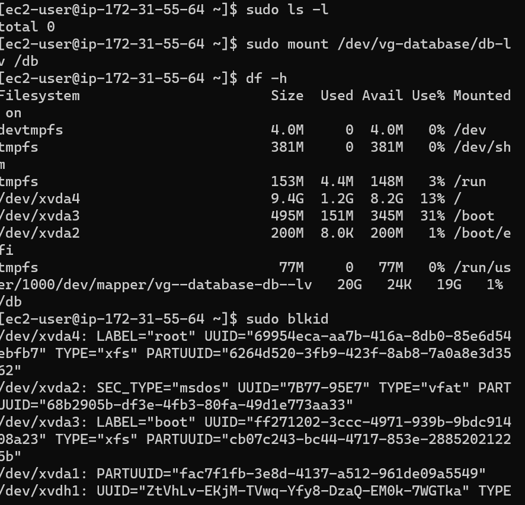`

use the `df-h` to check the mounts
### update the /etc/fstab file
The UUID of the device will be used to update the /etc/fstab file;
use this command to get the UUID `sudo blikd`

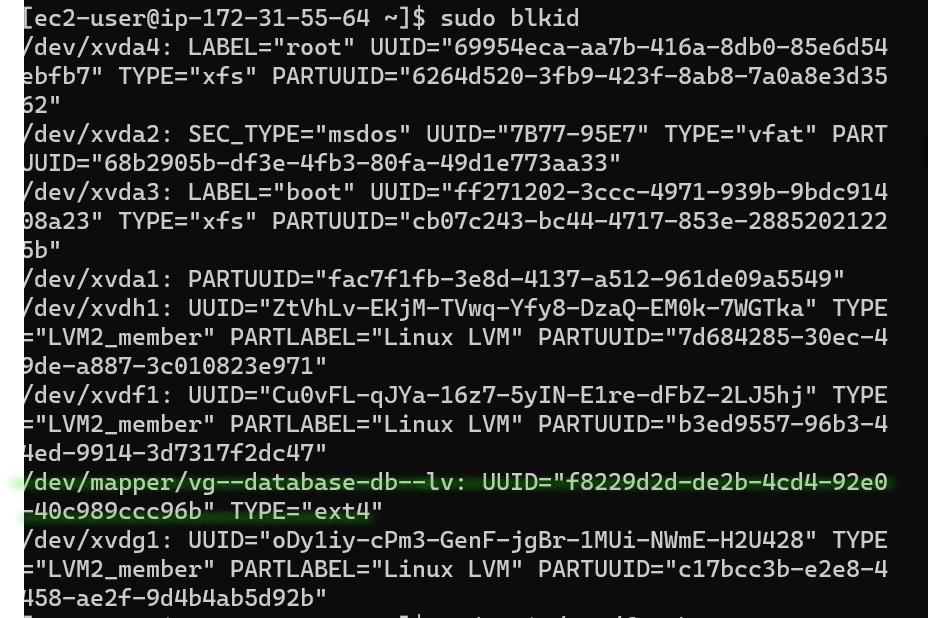

`sudo vi /etc/fstab`

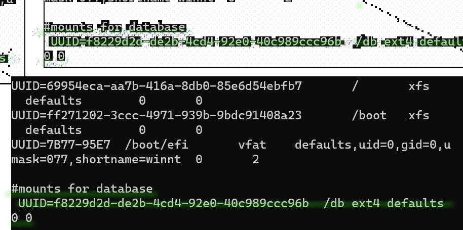

Test the configuration and reload the daemon
`sudo mount -a`

`sudo systemctl daemon-reload`

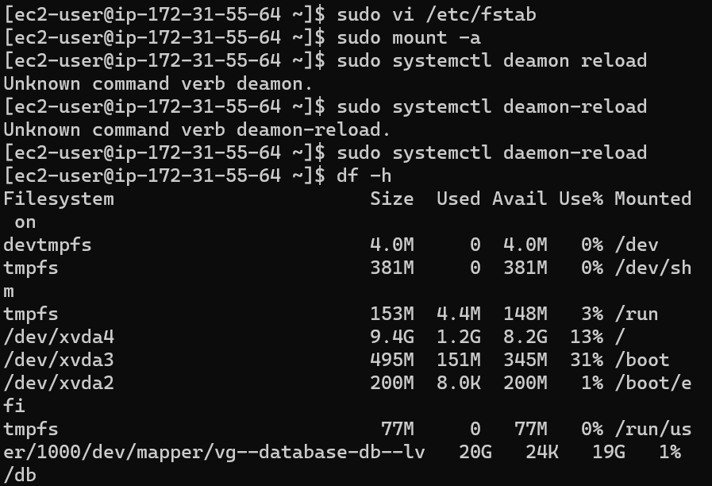

use df-h to verify setup;

### Step 3 — Install WordPress on your Web Server EC2
Update the repository

`sudo yum -y update`

To install PHP and its depemdencies
check the current php version and update it to the latest version

`sudo dnf install https://dl.fedoraproject.org/pub/epel/epel-release-latest-8.noarch.rpm`

`sudo dnf install dnf-utils http://rpms.remirepo.net/enterprise/remi-release-8.rpm`

 `sudo dnf module list php`
 `sudo dnf install php php-opcache php-gd php-curl php-mysqlnd`
`php -v`

start and enable the php page 

`sudo systemctl start php-fpm`
`sudo systemctl enable php-fpm`

check the status of the php

`sudo systemctl status php-fpm`

`sudo systemctl restart httpd`
`sudo setsebool -P httpd_execmem `

 
`sudo yum -y install wget httpd php php-mysqlnd php-fpm php-json`

Start Apache

`sudo systemctl enable httpd`

`sudo systemctl start httpd`

`sudo systemctl status httpd`

 

 

Restart Apache

`sudo systemctl restart httpd`
 
Download wordpress and copy wordpress to var/www/html
 
`mkdir wordpress`
`cd   wordpress`

Install wget, Apache and it’s dependencies
install wget
`sudo yum install wget`

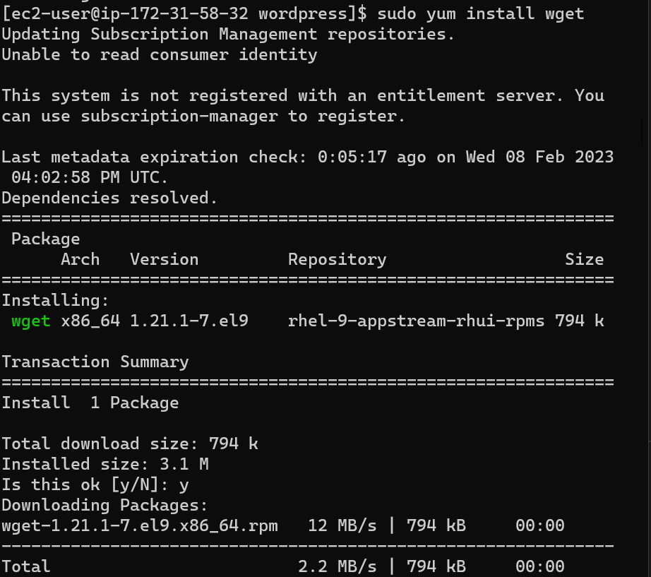

    sudo wget http://wordpress.org/latest.tar.gz
    sudo tar xzvf latest.tar.gz
    sudo rm -rf latest.tar.gz
    sudo cp wordpress/wp-config-sample.php wordpress/wp-config.php
    sudo cp -R wordpress /var/www/html/
 

 open this file in var/www/html folder

 `sudo vi wp-config.php`

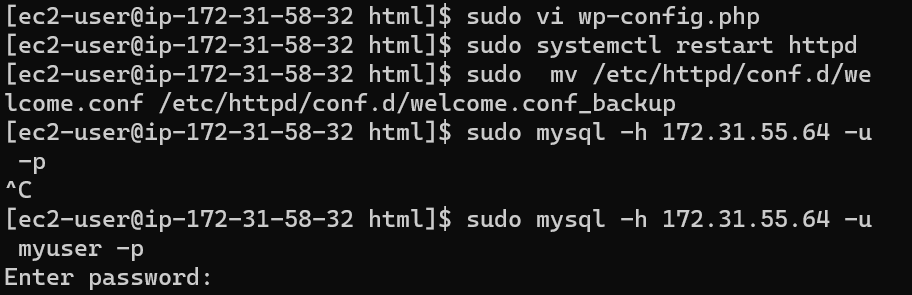
 

 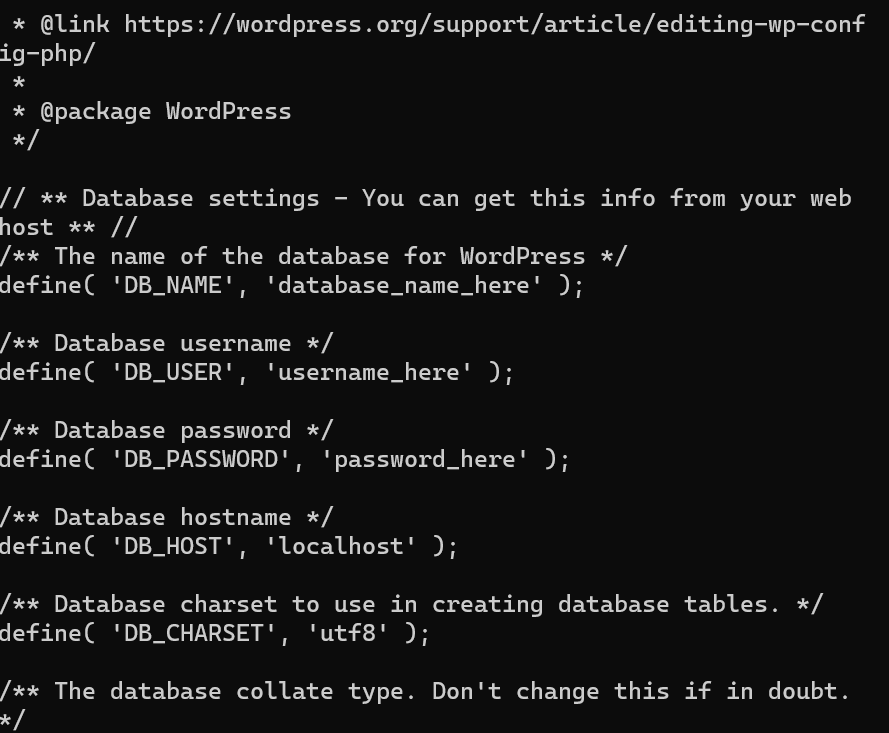

 Edit the DB_NAME and DB_USER and DB_PASSWORD and DB_HOST as inputed and created in your database server
Remember to restart the apache after changing the file
 `sudo systemctl restart httpd`

install my sql-server on var/www/html directory
 `sudo yum install mysql-server`
  `sudo systemctl start mysqld`
 ` sudo systemctl enable mysqld`
### Step 4 — Install MySQL on your DB Server EC2

`sudo yum update`
`sudo yum install mysql-server`

Verify that the service is up and running by using sudo systemctl status mysqld, if it is not running, restart the service and enable it so it will be running even after reboot:

`sudo systemctl restart mysqld`

`sudo systemctl enable mysqld`

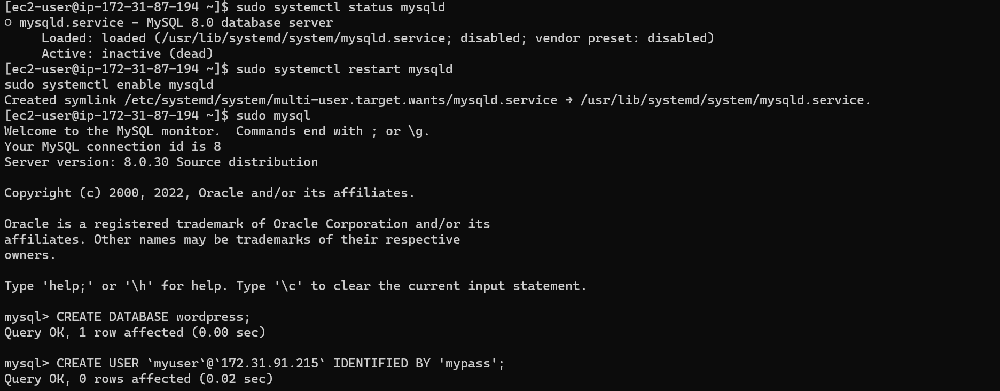

### Step 5 — Configure DB to work with WordPress
    sudo mysql
    CREATE DATABASE wordpress;
    CREATE USER `myuser`@`<Web-Server-Private-IP-Address>` IDENTIFIED BY 'mypass';
    GRANT ALL ON wordpress.* TO 'myuser'@'<Web-Server-Private-IP-Address>';
    FLUSH PRIVILEGES;
    SHOW DATABASES;
    exit

### Step 6 — Configure WordPress to connect to the remote database.

Configure SELinux Policies
 
       sudo chown -R apache:apache /var/www/html/wordpress
       sudo chcon -t httpd_sys_rw_content_t /var/www/html/wordpress -R
       sudo setsebool -P httpd_can_network_connect=1
	   sudo setsebool -P httpd_can_network_connect_db 1

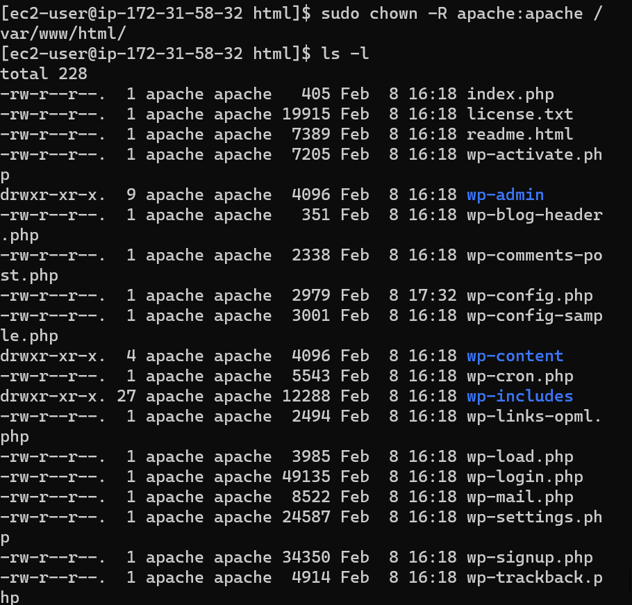   

Hint: Do not forget to open MySQL port 3306 on DB Server EC2. For extra security, you shall allow access to the DB server ONLY from your Web Server’s IP address, so in the Inbound Rule configuration specify source as /32

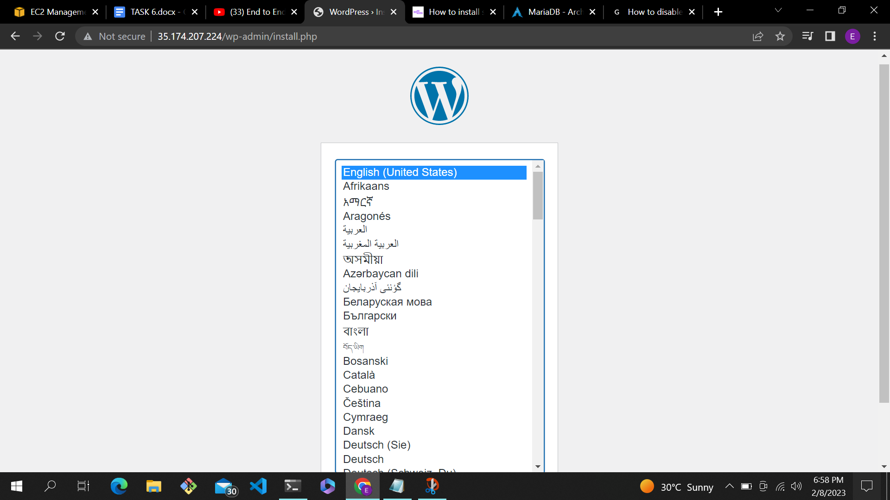
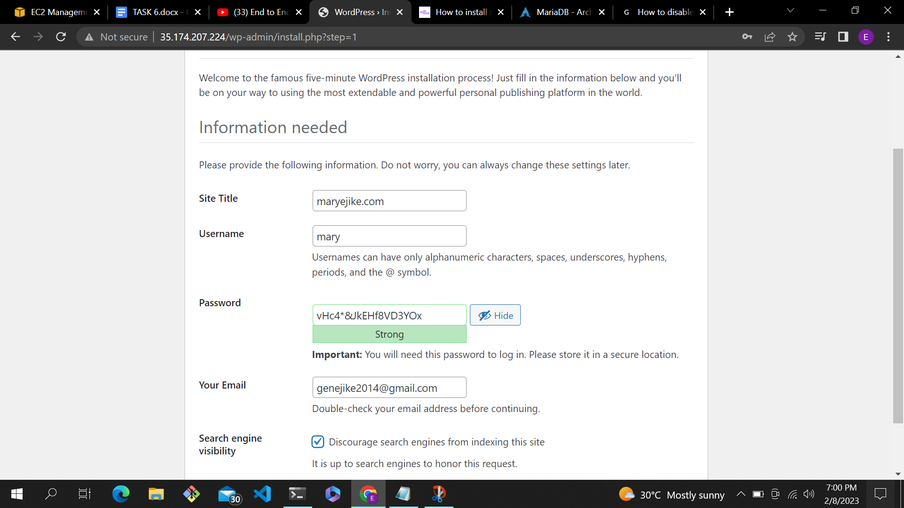
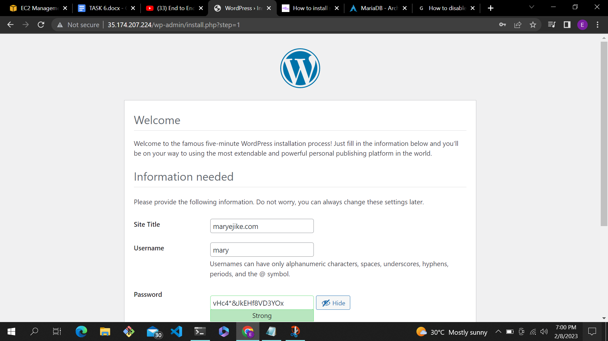
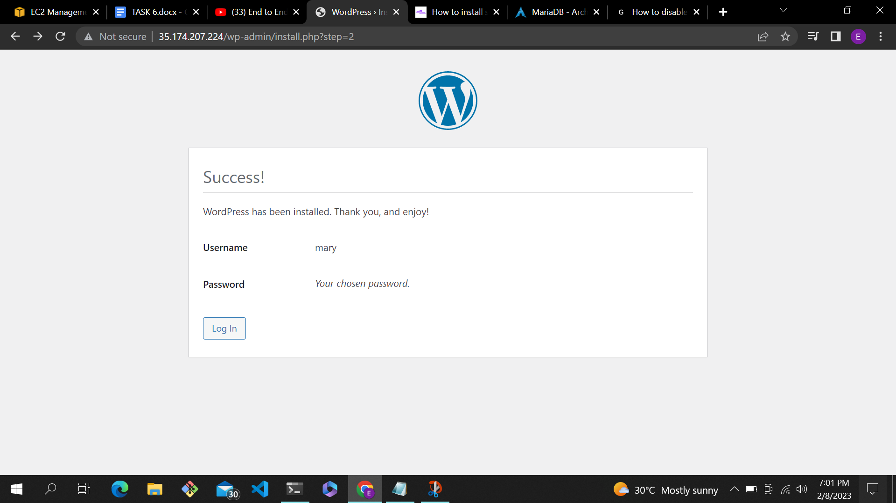
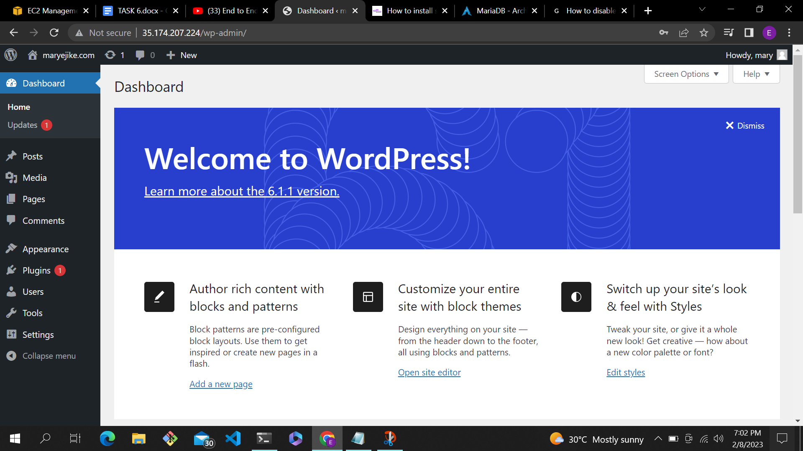

https://www.youtube.com/watch?v=fJnjuG-CK4g