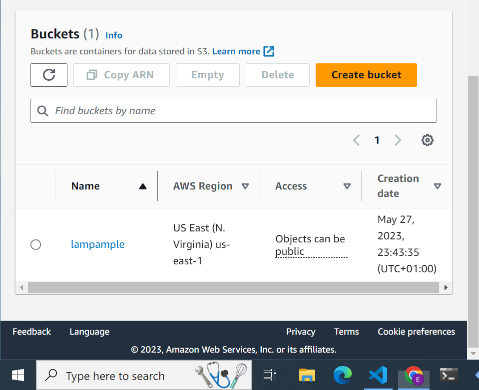
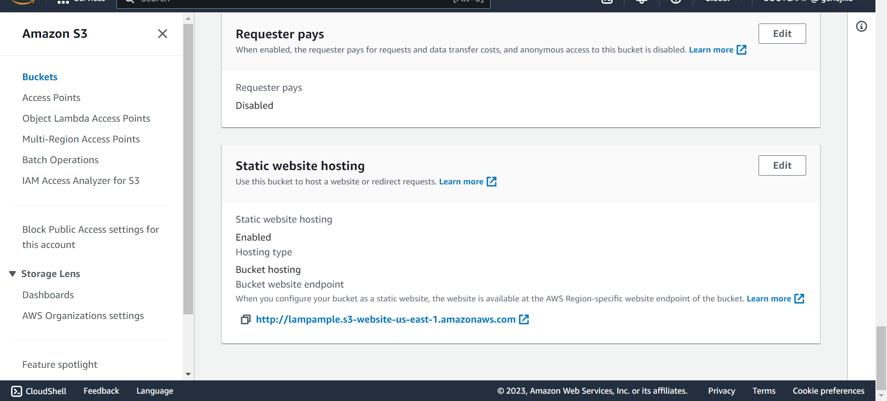
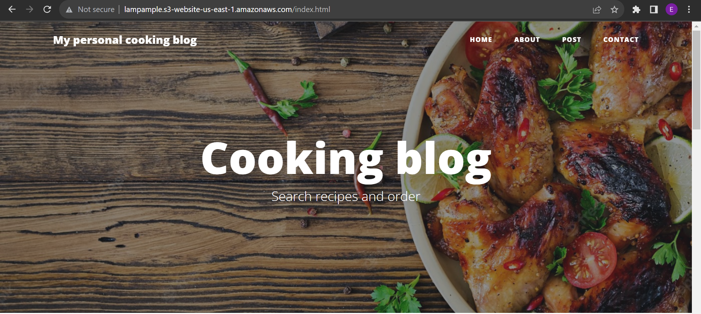

### HOST A STATIC WEBSITE
* Navigate to s3 from the aws management console .
* Type s3 from the find services and select s3 
* click on create bucket 
fill in your bucket name  and preferred region
* uncheck the "block public access to  s3 "
* click on create bucket 



* upload files to s3 bucket 

* click on add files and add folder button 
* Click "Add files" to upload the index.html file, and click "Add folder" to upload the css, img, and vendor folders.

OR
*  use the aws configure to set the aws cli configuration 

```aws configure list
aws configure 
aws configure set aws_session_token "<TOKEN>" --profile default 
```
* upload the files
* Create a PUBLIC bucket in the S3, and verify locally as
```
aws s3api list-buckets 
```
* download the file 

```
aws s3api put-object --bucket <bucket-name> --key index.html --body index.html
```
* Copy over folders from local to S3 
eg.
```
aws s3 cp img/ s3://<bucket-name>/<file-name>/ --recursive
``` 
* go to the permissions tab
and make sure the bucket access allows public access for hosting

8 edit bucket policy and add
```{
  "Version":"2012-10-17",
  "Statement":[
    {
      "Sid":"AddPerm",
      "Effect":"Allow",
      "Principal": "*",
      "Action":["s3:GetObject"],
      "Resource":["arn:aws:s3:::your-website/*"]
    }
  ]
}
```

* Go back to the properties tab and then scroll down to edit the static website hosting 
enable  the static website hosting 
input your 


### Distribution via cloud Front
* Go to cloud Front and create a distribution 

* Paste the Static website hosting endpoint of the form 
`.s3-website-region.amazonaws.com` for tha Origin > Domain Name field 

* use the defaults for the rest and create the distribution 

* you can access the webite via the cloud front domain name such as `d3bb7y5pgh8hll.cloudfront.net` when you paste it on the web browser

* All three links: CloudFront domain name, S3 object URL, and website-endpoint will show you the same `index.html` content.

