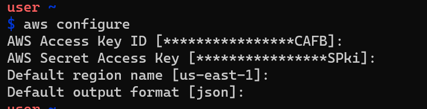
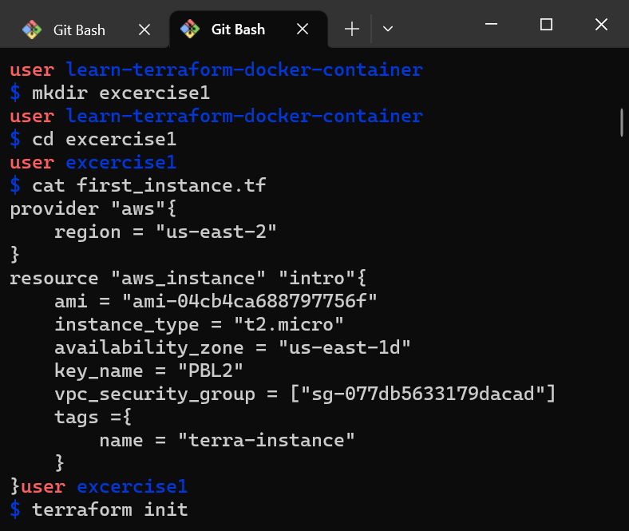
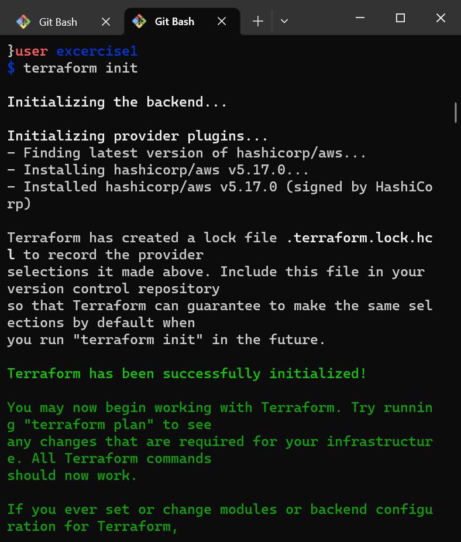
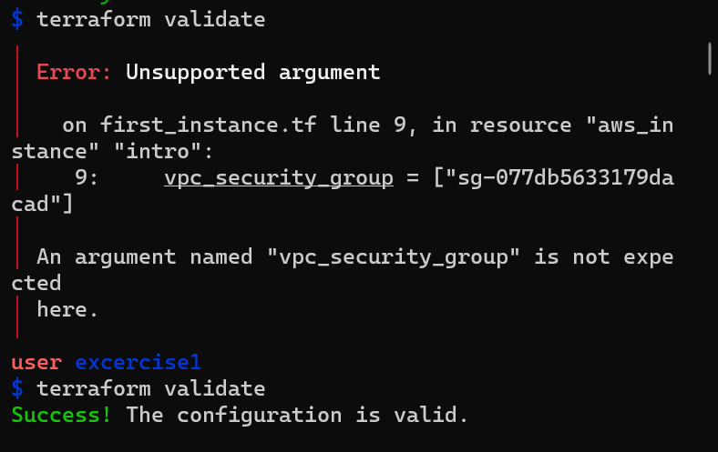
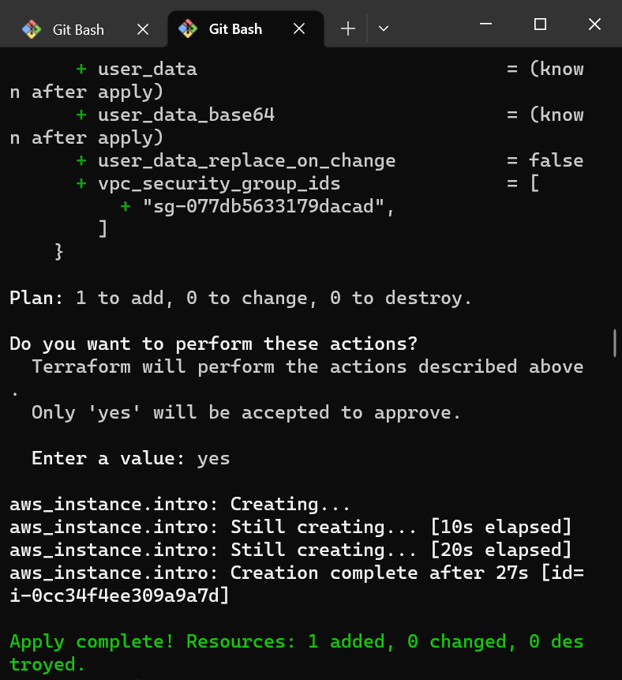
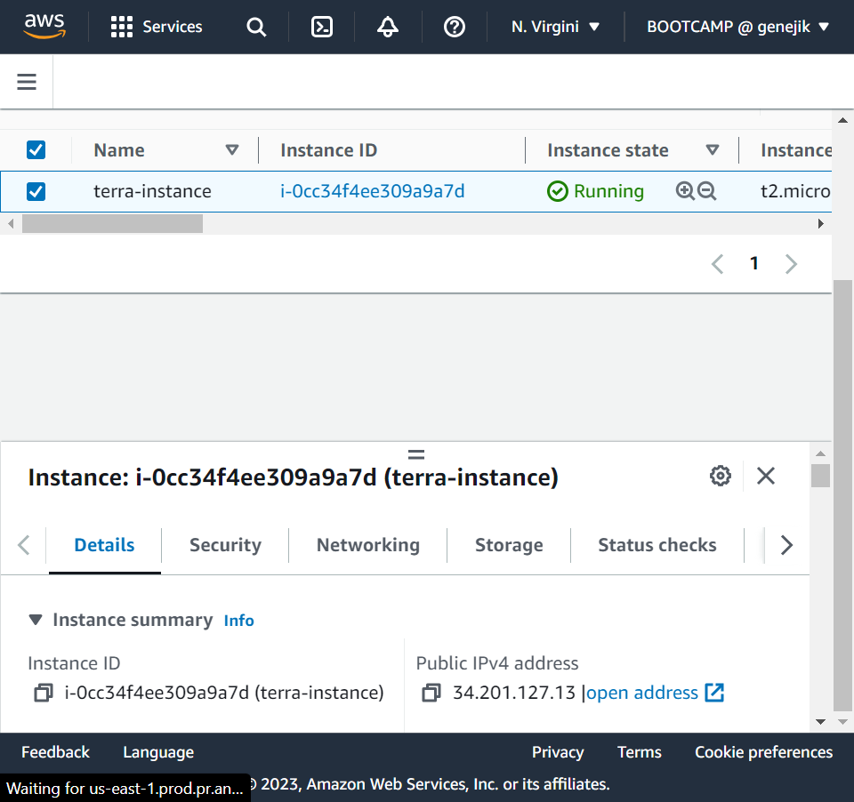

# DEPLOYING AN INSTANCE ON AWS WITH TERRAFORM 

* Install aws cli on your preferred terminal 
* confirm install with `aws --version`
* Run the aws configure to input your access key and secret key



* Ensure terraform is installed on your terminal with `terraform --help` otherwise go to terraform.io to download and install

* create a folder for the excercise and create your first .tf file eg main.tf

* specify details of instance to be deployed in the file using any editor of choice and save 

* verify on terminal

* Run
```
terraform init 
```


* Run 
``` 
terraform validate
``` 
to verify the arguments provided  if an error is made you would get a notification 



* `terraform fmt` formarts and arranges the file 
* Run the `terraform plan`
* Run `terraform apply`to perform the actions specified in the plan

* Always verify your operation with terraform plan so that you do not accidentaly destroy eg. your database instance
* The terraform.tfstate file holds information about your instance created 

