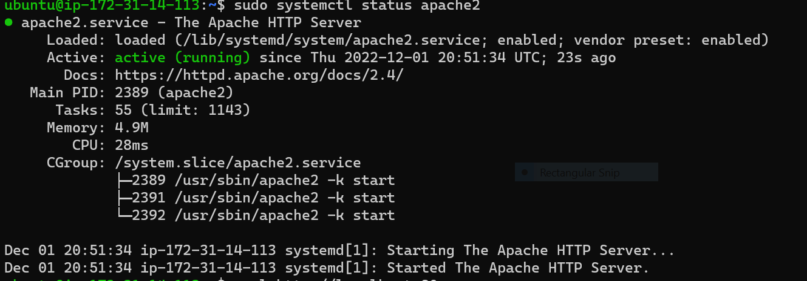

# WEB STACK IMPLMENTATION ON A LAMP STACK
* Researched on [SDLC](https://docs.google.com/document/d/1XHRlPkYiaCP0_HdCLPYkZ-asx46iRXh75zGujhACFDg/edit?usp=sharing)
* What does lamp stack [mean](https://docs.google.com/document/d/1DWf2WNxvZ8u2Btf_pxOvT-t1gGpf-RpP6Ng7JXg0WbM/edit?usp=sharing)?
* About [chmod and chown](https://docs.google.com/document/d/1SY830TRAm8v3sGbG2rJYXGIcfRQrupT9Ws7cBygwg7g/edit?usp=sharing)
* [TCP VS UDP ](https://docs.google.com/document/d/1mE1VflGGII3KyXQPPYtObUW2ioQwsen6f5AsoiPFXXs/edit?usp=sharing)
  
 ## AWS SETUP
- Created an aws account 
- Selected a preferred region (the closest to you) and launch a new EC2 instance of t2.micro family with Ubuntu Server 20.04 LTS (HVM)

*IMPORTANT – save your private key (.pem file) securely and do not share it with anyone! If you lose it, you will not be able to connect to your server ever again!*
- open windows terminal or git bash 
- ensure your in the downloads folder
  ```
  cd ~/Downloads
  ```
- change permissions on your file
  ```
  sudo chmod 0400 <private-key-name>. pem
  ```
- connect to your instance by running on your terminal
  ```
  ssh -i <private-key-name>. pem ubuntu@<Public-IP-address>
  ```


- I created MY very first Linux Server in the Cloud and our set up looks like this now: (You are the client)


* Remember to stop the instance when not using oh so as not to incure cost * 
## CONFIGURE THE EC2 MACHINE TO SERVE A WEB SERVER
### INSTALLING APACHE AND UPDATING THE FIREWALL
- Update a list of packages in package manager
```
sudo apt update
```
- Run apache2 package installation
```
sudo apt install apache2
```
- verify that apache2 is running as a Service in the OS

```
sudo systemctl status apache2
```


- In order to receive any traffic by our Web Server, we need to open TCP port 80 which is the default port that web browsers use to access web pages on the Internet

- Access apache server locally in our Ubuntu shell

```
curl http://localhost:80
```

- The ‘curl’ command  is used to request the  Apache HTTP Server on port 80
- Retrieve your Public IP address
```
curl -s http://169.254.169.254/latest/meta-data/public-ipv4
```


- This will not work anymore due to aws new security policies read on Metadata and IMDV2.This is the new waw to retrieve your Public IP address

```
TOKEN=`curl -X PUT "http://169.254.169.254/latest/api/token" -H "X-aws-ec2-metadata-token-ttl-seconds: 21600"` 
curl -H "X-aws-ec2-metadata-token: $TOKEN" -v http://169.254.169.254/latest/meta-data/public-ipv4

```
- Paste url on browser
```
http://<Public-IP-Address>:80
```


## Installing mySQL
* Now that you have a web server up and running, you need to install a Database Management System (DBMS) to be able to store and manage data for your site in a relational database
```
sudo apt install mysql-server
```


```
sudo mysql
```


- Set a password for the root user, using mysql_native_password

```
ALTER USER 'root'@'localhost' IDENTIFIED WITH mysql_native_password BY 'PassWord.1'; 
```
- Exit mysql
`exit `
```
sudo mysql_secure_installation
```
- Type Y when prompted then ENTER 


- login into the sql terminal

```
sudo mysql -p
```


- Exit the sql 
`exit`


## INSTALLING PHP
- Apache  is installed to serve your content and MySQLis installed to store and manage your data. PHP is the component of our setup that will process code to display dynamic content to the end user.In addition to the php package, you’ll need php-mysql, a PHP module that allows PHP to communicate with MySQL-based databases. You’ll also need libapache2-mod-php to enable Apache to handle PHP files. Core PHP packages will automatically be installed as dependencies

```
sudo apt install php libapache2-mod-php php-mysql
```


- confirm your PHP version
`php -v`
LAMP stack is working.
- lets  test our setup with a PHP script, it’s best to set up a proper Apache Virtual Host to hold your website’s files and folders. Virtual host allows you to have multiple websites located on a single machine and users of the websites will not even notice it.


## CREATING A VIRTUAL HOST FOR YOUR WEBSITE USING APACHE
- Set up a domain called projectlamp, but you can replace this with any domain of your choice.Apache on Ubuntu 20.04 has one server block enabled by default that is configured to serve documents from the /var/www/html directory. We will leave this configuration as is and will add our own directory next next to the default one.


- Create the directory for projectlamp
```
sudo mkdir /var/www/projectlamp
```

- Assign ownership of the directory with your current system user
```
sudo chown -R $USER:$USER /var/www/projectlamp
```

- create and open a new configuration file in Apache’s sites-available directory using your preferred command-line editor. Here, we’ll be using vi or vim 
`sudo vi /etc/apache2/sites-available/projectlamp.conf`


- Hit the esc button on the keyboard
- Type:
- Type wq. w for write and q for quit
- Hit ENTER to save the file

- show the new file in the sites-available directory
```
sudo ls /etc/apache2/sites-available
```


- Use a2ensite command to enable the new virtual host
`sudo a2ensite projectlamp`

- You might want to disable the default website that comes installed with Apache. This is required if you’re not using a custom domain name, because in this case Apache’s default configuration would overwrite your virtual host. To disable Apache’s default website use a2dissite command
`sudo a2dissite 000-default`

- Make sure your configuration file doesn’t contain syntax errors, run

`sudo apache2ctl configtest`

- Reload Apache so these changes take effect

`sudo systemctl reload apache2`

- Your new website is now active, but the web root /var/www/projectlamp is still empty. Create an index.html file in that location so that we can test that the virtual host works as expected

- `sudo echo 'Hello LAMP from hostname' $(curl -s http://169.254.169.254/latest/meta-data/public-hostname) 'with public IP' $(curl -s http://169.254.169.254/latest/meta-data/public-ipv4) > /var/www/projectlamp/index.html`

- open your website URL using IP address:

`http://<Public-IP-Address>:80`
* or *
`http://<Public-DNS-Name>:80`

- Expected outcome


- ENABLE PHP ON THE WEBSITE
- Once u set up an index.php file , remember to remove or rename the index.html file from your document root, as it would take precedence over an index.php file by default.
`sudo vim /etc/apache2/mods-enabled/dir.conf`

- Reload Apache so the changes take effect
`sudo systemctl reload apache2`

- Create a PHP script to test that PHP is correctly installed and configured on your server.
- Create a new file named index.php inside your custom web root folder

```
vi /var/www/projectlamp/index.php
```
- This will open a blank file. Add the following text, which is valid PHP code, inside the file:
`<?php
phpinfo();`
- save exit and reload the browser


- This page provides information about your server from the perspective of PHP. It is useful for debugging and to ensure that your settings are being applied correctly.If you can see this page in your browser, then your PHP installation is working as expected.After checking the relevant information about your PHP server through that page, it’s best to remove the file you created as it contains sensitive information about your PHP environment -and your Ubuntu server. You can use rm to do so:

```
sudo rm /var/www/projectlamp/index.php
```

## Resources used 
* https://www.markdownguide.org/cheat-sheet/
