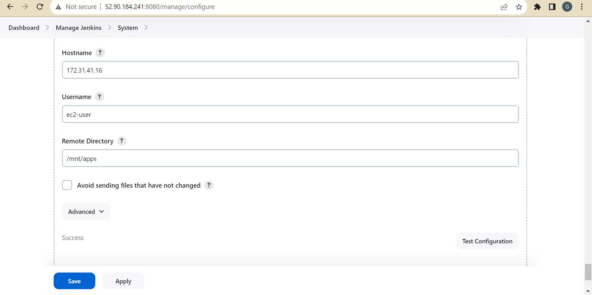

## TOOLING WEBSITE DEPLOYMENT AUTOMATION WITH CONTINUOUS INTEGRATION(JENKINS) 


Automation is the use of technology to perform tasks with where human input is minimized. 
Automation  of routine tasks is One of the ways to guarantee fast and repeatable deployments.

According to Circle CI, Continuous integration (CI) is a software development strategy that increases the speed of development while ensuring the quality of the code that teams deploy. Developers continually commit code in small increments (at least daily, or even several times a day), which is then automatically built and tested before it is merged with the shared repository.

!

### INSTALL AND CONFIGURE JENKINS SERVER
#### Step 1 – Install the Jenkins server
* Create an AWS EC2 server based on Ubuntu Server 20.04 LTS and name it "Jenkins"
* Head over to the official jenkins website to get the most recent installation codes at [JENKINS](https://www.jenkins.io/doc/book/installing/linux/#debianubuntu)
* Install JDK (since Jenkins is a Java-based application)

```sh
sudo apt update
sudo apt install openjdk-17-jre
```
* Install Jenkins
```sh
curl -fsSL https://pkg.jenkins.io/debian/jenkins.io-2023.key | sudo tee \
  /usr/share/keyrings/jenkins-keyring.asc > /dev/null
echo deb [signed-by=/usr/share/keyrings/jenkins-keyring.asc] \
  https://pkg.jenkins.io/debian binary/ | sudo tee \
  /etc/apt/sources.list.d/jenkins.list > /dev/null
sudo apt-get update
sudo apt-get install jenkins
```
* Make sure Jenkins is up and running

```sh
sudo systemctl status jenkins
```

* By default Jenkins server uses TCP port 8080 
- create a new Inbound Rule for port 8080 in your EC2 Security Group

- Perform initial Jenkins setup.
- From your browser access 
```
http://<Jenkins-Server-Public-IP-Address-or-Public-DNS-Name>:8080
```
- You will be prompted to provide a default admin password


Retrieve it from your server:
```sh
sudo cat /var/lib/jenkins/secrets/initialAdminPassword

```


Then you will be asked which plugings to install – choose suggested plugins.


* Once plugin installation is done ,create an admin user and you will get your Jenkins server address.
- i ran into this issue while creating an admin user 


i found the fix  [HERE](https://stackoverflow.com/questions/44711696/jenkins-403-no-valid-crumb-was-included-in-the-request) by doing this here just to get through our project 


The installation is completed!

### Step 2 – Configure Jenkins to retrieve source codes from GitHub using Webhooks
* Lets configure a simple Jenkins job/project . This job will be triggered by GitHub webhooks and will execute a ‘build’ task to retrieve codes from GitHub and store it locally on Jenkins server.
* Enable webhooks in your GitHub repository settings

- Go to webhooks 


click on create 
- Go to Jenkins web console, click "New Item" and create a "Freestyle project"


- To connect your GitHub repository, you will need to provide its URL, you can copy it from the repository itself


- In the configuration of your Jenkins freestyle project choose Git repository, and provide there the link to your Tooling GitHub repository and credentials (user/password) so Jenkins could access files in the repository.

- Save the configuration and let us try to run the build. For now, we can only do it manually.
- Click the "Build Now" button, if you have configured everything correctly, the build will be successful and you will see it under #1


- You can open the build and check in "Console Output" if it has run successfully.
If so – congratulations! You have just made your very first Jenkins build!


- But this build does not produce anything and it runs only when we trigger it manually. Let us fix it.
Click "Configure" your job/project and add these two configurations

- Configure triggering the job from the GitHub webhook:


- Configure "Post-build Actions" to archive all the files – files resulting from a build are called "artifacts".


- Now, go ahead and make some changes in any file in your GitHub repository (e.g. README.MD file) and push the changes to the master branch.
- You will see that a new build has been launched automatically (by webhook) and you can see its results – artifacts, saved on the Jenkins server.


* You have now configured an automated Jenkins job that receives files from GitHub by webhook trigger (this method is considered as ‘push’ because the changes are being ‘pushed’ and file transfer is initiated by GitHub). There are also other methods: trigger one job (downstream) from another (upstream), poll GitHub periodically and others.

By default, the artifacts are stored on the Jenkins server locally
```sh
ls /var/lib/jenkins/jobs/tooling_github/builds/<build_number>/archive/

```


### CONFIGURE JENKINS TO COPY FILES TO NFS SERVER VIA SSH
#### Step 3 – Configure Jenkins to copy files to NFS server via SSH
- Now we have our artifacts saved locally on Jenkins server, the next step is to copy them to our NFS server to /mnt/apps directory.
- We will need a plugin that is called "Publish Over SSH".
- Install the "Publish Over SSH" plugin.
On the main dashboard select "Manage Jenkins" and choose the "Plugins" menu item.
- On the "Available" tab search for the "Publish Over SSH" plugin and install it


- Configure the job/project to copy artifacts over to the NFS server.
- On the main dashboard select "Manage Jenkins" and choose the "Configure System" menu item.
- Scroll down to Publish over the SSH plugin configuration section and configure it to be able to connect to your NFS server:
```
* Provide a private key (the content of .pem file that you use to connect to the NFS server via SSH/Putty)
* Arbitrary name
* Hostname – can be private IP address of your NFS server
* Username – ec2-user (since the NFS server is based on EC2 with RHEL 8)
* Remote directory – /mnt/apps since our Web Servers use it as a mounting point to retrieve files from the NFS server
```

- Test the configuration and make sure the connection returns Success. 



- Remember, that TCP port 22 on NFS server must be open to receive SSH connections.

- Save the configuration, open your Jenkins job/project configuration page and add another one "Post-build Action"

* Configure it to send all files produced by the build into our previously define remote directory. In our case we want to copy all files and directories – so we use **.
If you want to apply some particular pattern to define which files to send – use [this syntax](https://ant.apache.org/manual/dirtasks.html#patterns).


Save this configuration and go ahead, and change something in README.MD file in your GitHub Tooling repository.
Webhook will trigger a new job and in the "Console Output" of the job you will find something like this:
SSH: Transferred 25 file(s)
Finished: SUCCESS

- I encountered an error on the file during the build 

- expand your console output to get more information about the failure 
- to further get more information i ticked this:


- check if the file is executable `ls -al /mnt`
- so I granted permissions to the files on the console with 
`sudo chmod 777 /mnt/apps`
`sudo chown -R nobody:nobody /mnt/apps`
check again and it passed 


* To make sure that the files in /mnt/apps have been updated – connect via SSH/Putty to your NFS server and check README.MD file
cat /mnt/apps/README.md
my change worked .

If you see the changes you had previously made in your GitHub – the job works as expected.


