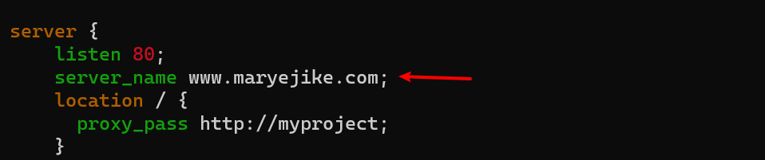

## LOAD BALANCER SOLUTION WITH NGINX AND SSL/TLS
In this project you will register your website with LetsEnrcypt Certificate Authority, to automate certificate issuance you will use a shell client recommended by LetsEncrypt – cetrbot.
#### Task
This project consists of two parts:
- Configure Nginx as a Load Balancer
- Register a new domain name and configure secured connection using SSL/TLS certificates
- Your target architecture will look like this:


#### CONFIGURE NGINX AS A LOAD BALANCER
* You can either uninstall Apache from the existing Load Balancer server, or create a fresh installation of Linux for Nginx.
* Create an EC2 VM based on Ubuntu Server 20.04 LTS and name it Nginx LB (do not forget to open TCP port 80 for HTTP connections, also open TCP port 443 – this port is used for secured HTTPS connections)
* Update /etc/hosts file for local DNS with Web Servers’ names (e.g. Web1 and Web2) and their local IP addresses
* Install and configure Nginx as a load balancer to point traffic to the resolvable DNS names of the webservers
* Update the instance and Install Nginx
```sh
sudo apt update
sudo apt install nginx
```

* Configure Nginx LB using Web Servers’ names defined in /etc/hosts

Hint: Read this blog to read about [/etc/host](https://linuxize.com/post/how-to-edit-your-hosts-file/)
Open the default nginx configuration file
```sh
sudo vi /etc/nginx/nginx.conf
```
```
#insert following configuration into http section


 upstream myproject {
    server Web1 weight=5;
    server Web2 weight=5;
  }


server {
    listen 80;
    server_name www.domain.com;
    location / {
      proxy_pass http://myproject;
    }
  }


#comment out this line
#       include /etc/nginx/sites-enabled/*;

```
* Restart Nginx and make sure the service is up and running
```sh
sudo systemctl restart nginx
sudo systemctl status nginx
```

* Read more about HTTP load balancing methods and features supported by Nginx on this [page](https://docs.nginx.com/nginx/admin-guide/load-balancer/http-load-balancer/)

#### REGISTER A NEW DOMAIN NAME AND CONFIGURE SECURED CONNECTION USING SSL/TLS CERTIFICATES
Let us make necessary configurations to make connections to our Tooling Web Solution secured!
In order to get a valid SSL certificate – you need to register a new domain name, you can do it using any Domain name registrar – I am using namecheap.com 
* Register a new domain name with any registrar of your choice in any domain zone (e.g. .com, .net, .org, .edu, .info, .xyz or any other)
* Assign an Elastic IP to your Nginx LB server and associate your domain name with this Elastic IP
- You get a new public IP address. When you want to associate your domain name every time you restart or stop/start your EC2 instance. It is better to have a static IP address (Elastic IP)that does not change after reboot. 


#### Update A record in your registrar to point to Nginx LB using Elastic IP address
Learn how associate your domain name to your Elastic IP on this [page](https://saturncloud.io/blog/setting-up-amazon-ec2-with-namecheap-domain-and-subdomain-a-comprehensive-guide/).

1. Get your EC2 instance’s public IP address. Navigate to your EC2 Dashboard, click on “Instances” on the left sidebar, and select your instance. Your public IP address will be displayed in the description.

2. Sign in to your Namecheap account. Navigate to the “Domain List” and click on “Manage” next to the domain you want to link.

3. Navigate to the Advanced DNS tab. Here, you’ll add a new record.

4. Add an A Record. In the “Host” field, enter “@” to point the domain itself to your EC2 instance. In the “Value” field, enter your EC2 instance’s public IP address. Click on the green checkmark to save the record.


or using ROUTE53
- create a hosted zone in your aws account
- Input your domain name and click create   
- copy the ns record and paste it in your nameserver custom dns 


- click on create record 


* Side Self Study: Read about different DNS record types and learn what they are used for.
- Check that your Web Servers can be reached from your browser using new domain name using HTTP protocol – http://<your-domain-name.com>

* Configure Nginx to recognize your new domain name
* Update your nginx.conf with server_name www.<your-domain-name.com> instead of server_name www.domain.com
```sh
sudo vi /etc/nginx/nginx.conf
```


####  Install certbot and request for an SSL/TLS certificate
* Make sure snapd service is active and running
```sh
sudo systemctl status snapd
```

Install certbot
```sh
sudo snap install --classic certbot
```

* Request your certificate (just follow the certbot instructions – you will need to choose which domain you want your certificate to be issued for, domain name will be looked up from nginx.conf file so make sure you have updated it on step 4).
```sh
sudo ln -s /snap/bin/certbot /usr/bin/certbot
sudo certbot --nginx
```


* Test secured access to your Web Solution by trying to reach https://<your-domain-name.com>

* You shall be able to access your website by using HTTPS protocol (that uses TCP port 443) and see a padlock pictogram in your browser’s search string.

* Click on the padlock icon and you can see the details of the certificate issued for your website.

* Set up periodical renewal of your SSL/TLS certificate

* By default, LetsEncrypt certificate is valid for 90 days, so it is recommended to renew it at least every 60 days or more frequently.

- You can test renewal command in dry-run mode

```sh
sudo certbot renew --dry-run
```

* Best pracice is to have a scheduled job that to run renew command periodically. Let us configure a cronjob to run the command twice a day.
* To do so, lets edit the crontab file with the following command:
```sh
sudo vi crontab -e
```

Add following line:
```
* */12 * * *   root /usr/bin/certbot renew > /dev/null 2>&1
```

- You can always change the interval of this cronjob if twice a day is too often by adjusting schedule expression.

- Side Self Study: [Refresh your cron configuration knowledge ](https://crontab.guru/examples.html)


