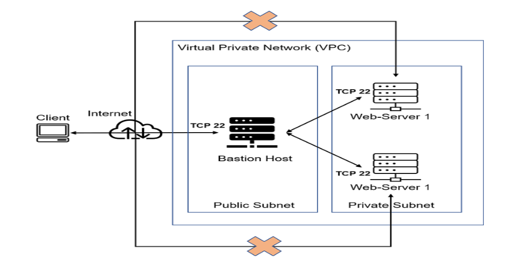
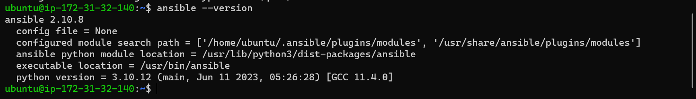
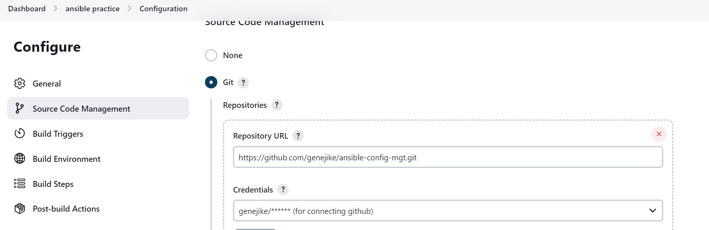
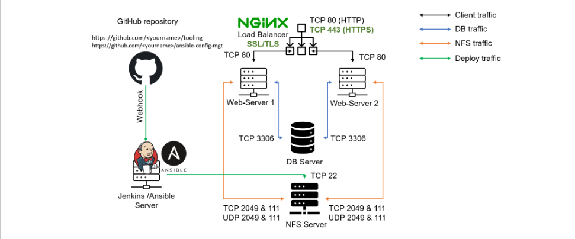
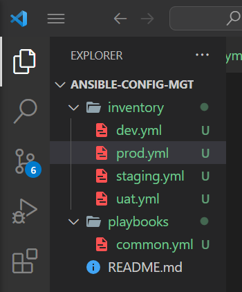
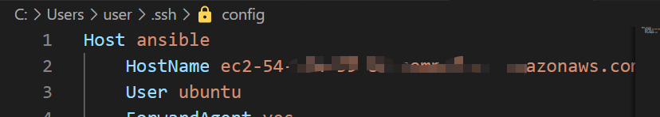
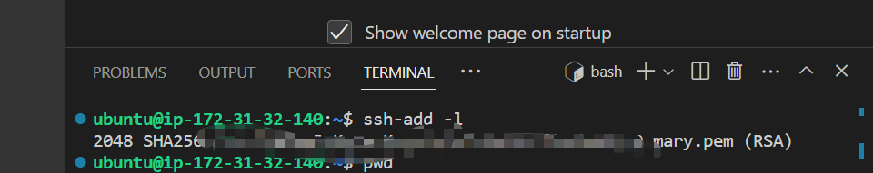

## ANSIBLE CONFIGURATION MANAGEMENT – AUTOMATE PROJECT 7 TO 10

### Ansible Client as a Jump Server (Bastion Host)

* A Jump Server (sometimes also referred as Bastion Host) is an intermediary server through which access to internal network can be provided. If you think about the current architecture you are working on, ideally, the webservers would be inside a secured network which cannot be reached directly from the Internet. That means, even DevOps engineers cannot SSH into the Web servers directly and can only access it through a Jump Server – it provide better security and reduces attack surface.
On the diagram below the Virtual Private Network (VPC) is divided into two subnets – Public subnet has public IP addresses and Private subnet is only reachable by private IP addresses.





* you will see a Bastion host in proper action. But for now, we will
develop Ansible scripts to simulate the use of a Jump box/Bastion host to access our Web Servers.

Task
* Install and configure Ansible client to act as a Jump Server/Bastion Host
* Create a simple Ansible playbook to automate servers configuration

#### INSTALL AND CONFIGURE ANSIBLE ON EC2 INSTANCE

* Update Name tag on your Jenkins EC2 Instance to Jenkins-Ansible. We will use this server to run  playbooks.

In your GitHub account create a new repository and name it ansible-config-mgt.

* Install Ansible

```sh
sudo apt update
sudo apt install ansible
```

* Check your Ansible version by running ansible --version



* Configure Jenkins build job to save your repository content every time you change it – this will solidify your Jenkins configuration skills .

* Create a new Freestyle project ansible in Jenkins and point it to your ‘ansible-config-mgt’ repository.



* when creating credentials github does not support password authentication anymore for private git repositories  so i used personal access token [video for private  repository connection](https://www.youtube.com/watch?v=AYohbnOqox0) but if it is public just provide the url, theres no need for authentication [video for public repository](https://www.youtube.com/watch?v=bWcWbMtMK24)
#### Steps for setting up a personal access token 

1. Navigate to GitHub:
- Open your web browser and go to GitHub.
 Login to Your GitHub Account:
- If you're not already logged in, log in to your GitHub account.

2. Access Personal Access Tokens:
- In the top-right corner, click on your profile picture, and then click on "Settings."
3. Go to Developer Settings:
- In the left sidebar, click on "Developer settings."
4. Generate a New Token:
- In the "Access tokens" section, click on "Generate token."
5. Enter Token Description:
- Provide a descriptive name for the token in the "Token description" field.
6. Select Scopes:
- Under "Select scopes," make sure to select the following scopes:
repo: This grants full control of private repositories.
admin:repo_hook: This grants read and write access to repository hooks.
Generate Token:
- Scroll down and click on the "Generate token" button.
Copy the Token:
- Once the token is generated, GitHub will display it. Copy the token to a secure location.
Important: Save the Token:
GitHub will not display the token again. Make sure to copy and save it securely.
Use the Token in Jenkins:

#####  In Jenkins, when adding GitHub credentials, use this token as a secret text credential.

- Open Jenkins:
Open your Jenkins instance in a web browser.
Navigate to Credentials:

- Click on "Manage Jenkins" in the Jenkins dashboard.Then, click on "Manage Credentials."
- Add a New Secret Text Credential:
Click on "(global)" to manage global credentials that can be used across all jobs.
Under the "Stores scoped to Jenkins" section, click on "(global)" again.
Click on "Add Credentials" on the left sidebar.
- Choose Credential Type:
In the "Kind" dropdown, select "Secret text."
- Enter Token as Secret:
In the "Secret" field, paste the GitHub Personal Access Token that you copied earlier.
- Set an ID:
Optionally, you can set an ID for the credential.
- Add a Description:
Provide a description to help identify the purpose of this credential.
- Click OK
- Now you have a GitHub Personal Access Token with the necessary permissions. Use this token with Jenkins to configure the GitHub credentials for your repository. Keep the token secure and do not share it publicly. If you ever need to revoke the token's access, you can do so in your GitHub account settings.


#### continue configuration 

-  Configure Webhook in GitHub and set webhook to trigger ansible build.

- Configure a Post-build job to save all (**) files, like you did it in Project 9.

Test your setup by making some change in README.MD file in master branch and make sure that builds starts automatically and Jenkins saves the files (build artifacts) in following folder
```sh
ls /var/lib/jenkins/jobs/ansible/builds/<build_number>/archive/
```

Note: Trigger Jenkins project execution only for /main (master) branch.
Now your setup will look like this:


Tip:
 Every time you stop/start your Jenkins-Ansible server – you have to reconfigure GitHub webhook to a new IP address, in order to avoid it, it makes sense to allocate an Elastic IP to your Jenkins-Ansible server (you have done it before to your LB server in Project 10). Note that Elastic IP is free only when it is being allocated to an EC2 Instance, so do not forget to release Elastic IP once you terminate your EC2 Instance.

### Step 2 – Prepare your development environment using Visual Studio Code
First part of ‘DevOps’ is ‘Dev’, which means you will require to write some codes and you shall have proper tools that will make your coding and debugging comfortable – you need an Integrated development environment (IDE) or Source-code Editor. There is a plethora of different IDEs and Source-code Editors for different languages with their own advantages and drawbacks, you can choose whichever you are comfortable with, but we recommend one free and universal editor that will fully satisfy your needs – Visual Studio Code (VSC), you can get it here.
After you have successfully installed VSC, configure it to connect to your newly created GitHub repository.

* Clone down your ansible-config-mgt repo to your Jenkins-Ansible instance
```sh

git clone <ansible-config-mgt repo link>

```


#### BEGIN ANSIBLE DEVELOPMENT
In your ansible-config-mgt GitHub repository, create a new branch that will be used for development of a new feature.
- Tip: Give your branches descriptive and comprehensive names, for example, if you use Jira or Trello as a project management tool – include ticket number (e.g. PRJ-145) in the
 name of your branch and add a topic and a brief description what this branch is about – a bugfix, hotfix, feature, release (e.g. feature/prj-145-lvm)

- Checkout the newly created feature branch to your local machine and start building your code and directory structure

- Create a directory and name it playbooks – it will be used to store all your playbook files.
- Create a directory and name it inventory – it will be used to keep your hosts organised.
- Within the playbooks folder, create your first playbook, and name it common.yml
- Within the inventory folder, create an inventory file (.yml) for each environment (Development,  Staging Testing and Production) dev, staging, uat, and prod respectively.


#### Step 4 – Set up an Ansible Inventory
- An Ansible inventory file defines the hosts and groups of hosts upon which commands, modules, and tasks in a playbook operate. Since our intention is to execute Linux commands on remote hosts, and ensure that it is the intended configuration on a particular server that occurs. It is important to have a way to organize our hosts in such an Inventory.
- Save below inventory structure in the inventory/dev file to start configuring your development servers. Ensure to replace the IP addresses according to your own setup.

**Note**: Ansible uses TCP port 22 by default, which means it needs to ssh into target servers from Jenkins-Ansible host – for this you can implement the concept of ssh-agent. Now you need to import your key into ssh-agent:

- To learn how to setup SSH agent and connect VS Code to your Jenkins-Ansible instance, please see this video:

1. For Windows users – [ssh-agent on windows](https://youtu.be/OplGrY74qog)

[get started with ssh](https://learn.microsoft.com/en-us/windows-server/administration/openssh/openssh_install_firstuse?tabs=powershell)

[opensshkeymanagement](https://learn.microsoft.com/en-us/windows-server/administration/openssh/openssh_keymanagement)

2.  For Linux users – [ssh-agent on linux](https://youtu.be/OplGrY74qog)

 * on your vscode terminal
- click ctrl+shift+p
- search ssh and select open ssh configuration 
- then select the first file and add to the config file 
- i added forwarding agent yes but it is advised not to do that 


```sh
eval `ssh-agent -s`
ssh-add <path-to-private-key>
```
- Confirm the key has been added with the command below, you should see the name of your key
```
ssh-add -l
```


Now, ssh into your Jenkins-Ansible server using ssh-agent
```sh 
ssh -A ubuntu@public-ip
```

Also notice, that your Load Balancer user is ubuntu and user for RHEL-based servers is ec2-user.

Update your inventory/dev.yml file with this snippet of code:
```
[nfs]
<NFS-Server-Private-IP-Address> ansible_ssh_user='ec2-user'

[webservers]
<Web-Server1-Private-IP-Address> ansible_ssh_user='ec2-user'
<Web-Server2-Private-IP-Address> ansible_ssh_user='ec2-user'

[db]
<Database-Private-IP-Address> ansible_ssh_user='ec2-user' 

[lb]
<Load-Balancer-Private-IP-Address> ansible_ssh_user='ubuntu'
```


#### CREATE A COMMON PLAYBOOK

##### Step 5 – Create a Common Playbook

It is time to start giving Ansible the instructions on what you needs to be performed on all servers listed in inventory/dev.
In common.yml playbook you will write configuration for repeatable, re-usable, and multi-machine tasks that is common to systems within the infrastructure.
Update your playbooks/common.yml file with following code:
```yml
- name: update web, nfs and db servers
  hosts: webservers, nfs, db
  remote_user: ec2-user
  become: yes
  become_user: root
  tasks:
    - name: ensure wireshark is at the latest version
      yum:
        name: wireshark
        state: latest

- name: update LB server
  hosts: lb
  remote_user: ubuntu
  become: yes
  become_user: root
  tasks:
    - name: Update apt repo
      apt: 
        update_cache: yes

    - name: ensure wireshark is at the latest version
      apt:
        name: wireshark
        state: latest
```
- Examine the code above and try to make sense out of it. This playbook is divided into two parts, each of them is intended to perform the same task:
 
- install wireshark utility (or make sure it is updated to the latest version) on your RHEL 8 and Ubuntu servers. It uses root user to perform this task and respective package manager: yum for RHEL 8 and apt for Ubuntu.

- Feel free to update this playbook with following tasks:
Create a directory and a file inside it
Change timezone on all servers
Run some shell script


#### Step 6 – Update GIT with the latest code
- use git commands to add, commit and push your branch to GitHub.

git status

git add <selected files>

git commit -m "commit message"

Create a Pull request (PR)


- Head back on your terminal, checkout from the feature branch into the master, and pull down the latest changes.
Once your code changes appear in master branch – Jenkins will do its job and save all the files (build artifacts) to /var/lib/jenkins/jobs/ansible/builds/<build_number>/archive/ directory on Jenkins-Ansible server.


#### RUN FIRST ANSIBLE TEST
#### Step 7 – Run first Ansible test
Now, it is time to execute ansible-playbook command and verify if your playbook actually works:
- cd ansible-config-mgtansible-playbook -i inventory/dev.yml playbooks/common.yml
You can go to each of the servers and check if wireshark has been installed by running which wireshark or wireshark --version

Your updated with Ansible architecture now looks like this:

- Optional step – Repeat once again
Update your ansible playbook with some new Ansible tasks and go through the full checkout -> change codes -> commit -> PR -> merge -> build -> ansible-playbook cycle again to see how easily you can manage a servers fleet of any size with just one command!

[git flow](https://www.atlassian.com/git/tutorials/comparing-workflows/gitflow-workflow)