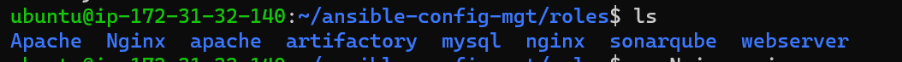

#### EXPERIENCE CONTINUOUS INTEGRATION WITH JENKINS | ANSIBLE | ARTIFACTORY | SONARQUBE | PHP
Ansible Inventory should look like this
```
├── ci
├── dev
├── pentest
├── pre-prod
├── prod
├── sit
└── uat
```
- ci inventory file

```yml
[jenkins]
<Jenkins-Private-IP-Address>

[nginx]
<Nginx-Private-IP-Address>

[sonarqube]
<SonarQube-Private-IP-Address>

[artifact_repository]
<Artifact_repository-Private-IP-Address>
```

- dev inventory file
```yml
[tooling]
<Tooling-Web-Server-Private-IP-Address>

[todo]
<Todo-Web-Server-Private-IP-Address>

[nginx]
<Nginx-Private-IP-Address>

[db:vars]
ansible_user=ec2-user

[db]
<DB-Server-Private-IP-Address>
```
- pentest inventory file
```yml
[pentest:children]
pentest-todo
pentest-tooling

[pentest-todo]
<Pentest-for-Todo-Private-IP-Address>

[pentest-tooling]
<Pentest-for-Tooling-Private-IP-Address>
```
#### ANSIBLE ROLES FOR CI ENVIRONMENT

Now go ahead and Add two more roles to ansible:

- SonarQube 
- Artifactory
1. creating sonarcube role 
```sh
ansible-galaxy role install -p . lrk.sonarqube
mv lrk.sonarqube/ sonarqube
```
2. creating artifactory roles 
```sh
ansible-galaxy role install -p . robertdebock.artifactory
mv robertdebock.artifactory/ Artifactory
```


[ansible galaxy](https://galaxy.ansible.com/ui/standalone/roles/): this site contains production ready roles you can use 

- Configuring the Jenkins Server
Install jenkins with its dependencies using the official documentation from [Jenkins](https://www.jenkins.io/doc/book/installing/linux/)

Update the bash profile
```sh
sudo -i
nano .bash_profile
```
```sh
export JAVA_HOME=$(dirname $(dirname $(readlink $(readlink $(which java)))))
export PATH=$PATH:$JAVA_HOME/bin 
export CLASSPATH=.:$JAVA_HOME/jre/lib:$JAVA_HOME/lib:$JAVA_HOME/lib/tools.jar
```
Reload the bash profile
`source ~/.bash_profile`

NB: This is done so that the path is exported anytime the machine is restarted

Start the jenkins server
```sh
sudo systemctl start jenkins
sudo systemctl enable jenkins
sudo systemctl status jenkins
```
- Install git and clone down your ansible-congig-mgt repo

### Configuring Ansible For Jenkins Deployment
In previous projects, you have been launching Ansible commands manually from a CLI. Now, with Jenkins, we will start running Ansible from Jenkins UI. To do this,

- Navigate to Jenkins URL
- Install & Open Blue Ocean Jenkins Plugin
- Create a new pipeline
- Select GitHub
- Login to GitHub & Generate an Access Token
- github access token
- Copy Access Token
- Paste the token and connect
- Create a new pipelne
- create pipeline
- click on Administration to exit the Blue Ocean console.

- Create our Jenkinsfile
- Inside the Ansible project, create a new directory deploy and start a new file Jenkinsfile inside the directory.

Add the code snippet below to start building the Jenkinsfile gradually. This pipeline currently has just one stage called Build and the only thing we are doing is using the shell script module to echo Building Stage
```Groovy
pipeline {
    agent any

  stages {
    stage('Build') {
      steps {
        script {
          sh 'echo "Building Stage"'
        }
      }
    }
    }
}
```
Now go back into the Ansible pipeline in Jenkins, and select configure

Scroll down to Build Configuration section and specify the location of the Jenkinsfile at deploy/Jenkinsfile

This will trigger a build and you will be able to see the effect of our basic Jenkinsfile configuration by going through the console output of the build.

View this with Blue ocean

Let us see this in action.

Create a new git branch and name it feature/jenkinspipeline-stages
create branch

Currently we only have the Build stage. Let us add another stage called Test. Paste the code snippet below and push the new changes to GitHub.
```Groovy
 pipeline {
    agent any

  stages {
    stage('Build') {
      steps {
        script {
          sh 'echo "Building Stage"'
        }
      }
    }

    stage('Test') {
      steps {
        script {
          sh 'echo "Testing Stage"'
        }
      }
    }
    }
}

```
  
To make your new branch show up in Jenkins, we need to tell Jenkins to scan the repository.
scan repo now

In Blue Ocean, you can now see how the Jenkinsfile has caused a new step in the pipeline launch build for the new branch.
blueocean2

Add more stages into the Jenkins file to simulate below phases. (Just add an echo command like we have in build and test stages)

Package
Deploy
Clean up
Verify in Blue Ocean that all the stages are working, then merge your feature branch to the main branch

added more stages to branch

Eventually, your main branch should have a successful pipeline like this in blue ocean.
added more stages to main

RUNNING ANSIBLE PLAYBOOK FROM JENKINS
Now that you have a broad overview of a typical Jenkins pipeline. Let us get the actual Ansible deployment to work by:

Installing Ansible on Jenkins Server
```sh
sudo yum install ansible -y
python3 -m pip install --upgrade setuptools
python3 -m pip install --upgrade pip
python3 -m pip install PyMySQL
python3 -m pip install mysql-connector-python
python3 -m pip install psycopg2-binary

```

Installing Ansible plugin in Jenkins UI
install ansible plugin

Add credentials in Jenkins UI


Configure ansible in UI


To get the path of a package use the which command
```sh
which ansible
```


config ansible ui1

Generate your ansible playbook command by using pipeline syntax
pipeline syntax0 pipeline syntax1 pipeline syntax2

Creating Jenkinsfile from scratch. (Delete all you currently have in there and start all over to get Ansible to run successfully)
```Groovy
pipeline {
  agent any

  environment {
      ANSIBLE_CONFIG="${WORKSPACE}/deploy/ansible.cfg"
    }

  parameters {
      string(name: 'inventory', defaultValue: 'dev',  description: 'This is the inventory file for the environment to deploy configuration')
    }

  stages{
      stage("Initial cleanup") {
          steps {
            dir("${WORKSPACE}") {
              deleteDir()
            }
          }
        }

      stage('Checkout SCM') {
         steps{
            git branch: 'main', url: 'https://github.com/IwunzeGE/ansible-config-mgt.git'
         }
       }

      stage('Prepare Ansible For Execution') {
        steps {
          sh 'echo ${WORKSPACE}' 
          sh 'sed -i "3 a roles_path=${WORKSPACE}/roles" ${WORKSPACE}/deploy/ansible.cfg'  
        }
     }

      stage('Run Ansible playbook') {
        steps {
           ansiblePlaybook become: true, colorized: true, credentialsId: 'private-key', disableHostKeyChecking: true, installation: 'ansible', inventory: 'inventory/dev', playbook: 'playbooks/site.yml'
         }
      }
      stage('Clean Workspace after build'){
        steps{
          cleanWs(cleanWhenAborted: true, cleanWhenFailure: true, cleanWhenNotBuilt: true, cleanWhenUnstable: true, deleteDirs: true)
        }
      }
    }
  }
```

Create the ansible config file in the deploy dir ansible.cfg and paste the code below
```yml
[defaults]
timeout = 160
callback_whitelist = profile_tasks
log_path=~/ansible.log
host_key_checking = False
gathering = smart
ansible_python_interpreter=/usr/bin/python3
allow_world_readable_tmpfiles=true


[ssh_connection]
ssh_args = -o ControlMaster=auto -o ControlPersist=30m -o ControlPath=/tmp/ansible-ssh-%h-%p-%r -o ServerAliveInterval=60 -o ServerAliveCountMax=60 -o ForwardAgent=yes
Run a build and ensure the playbook was well executed
pipeline built

```


Parameterizing Jenkinsfile For Ansible Deployment
To deploy to other environments, we will need to use parameters.

Update sit inventory with new servers

```yml
[tooling]
<SIT-Tooling-Web-Server-Private-IP-Address>

[todo]
<SIT-Todo-Web-Server-Private-IP-Address>

[nginx]
<SIT-Nginx-Private-IP-Address>

[db:vars]
ansible_user=ec2-user

[db]
<SIT-DB-Server-Private-IP-Address>
```
Update Jenkinsfile to introduce parameterization. Below is just one parameter. It has a default value in case if no value is specified at execution. It also has a description so that everyone is aware of its purpose.
```Groovy
pipeline {
    agent any

    parameters {
      string(name: 'inventory', defaultValue: 'dev',  description: 'This is the inventory file for the environment to deploy configuration')
    }
}
```
In the Ansible execution section, remove the hardcoded inventory/dev and replace with ``${inventory}`. From now on, each time you hit on execute, it will expect an input.

Run a build with parameter to put it to test. build with parameters

### CI/CD PIPELINE FOR TODO APPLICATION
Phase 1 – Prepare Jenkins
Fork the repository below into your GitHub account https://github.com/IwunzeGE/php-todo.git

On you Jenkins server, install PHP, its dependencies and Composer tool (Feel free to do this manually at first, then update your Ansible accordingly later)

```sh
sudo apt update
sudo apt install -y software-properties-common
sudo add-apt-repository ppa:ondrej/php -y
sudo apt update
sudo apt install -y php7.4 php7.4-common php7.4-mbstring php7.4-opcache php7.4-intl php7.4-xml php7.4-gd php7.4-curl php7.4-mysql php7.4-fpm php7.4-json
sudo systemctl start php7.4-fpm
sudo systemctl enable php7.4-fpm
```

- Install composer
https://support.cloudways.com/en/articles/5708669-how-to-install-and-use-composer

```sh
curl -sS https://getcomposer.org/installer | php
sudo mv composer.phar /usr/bin/composer
```
Verify Composer is installed or not
`composer --version`
Install phpunit, phploc
```sh
# Add EPEL repository
sudo apt install -y software-properties-common
sudo add-apt-repository universe
sudo add-apt-repository ppa:ondrej/php -y
sudo apt update

# Install PHP 7.4
sudo apt install -y php7.4 php7.4-cli php7.4-xml php7.4-mbstring php7.4-zip php7.4-mysql php7.4-curl php7.4-gd php7.4-imagick php7.4-intl php7.4-bcmath php7.4-json

# Install phploc from Remi repository
sudo apt install -y composer
composer global require phploc/phploc

# Install PHPUnit
wget -O phpunit https://phar.phpunit.de/phpunit-7.phar
chmod +x phpunit
sudo mv phpunit /usr/local/bin/phpunit

# Install Xdebug
sudo apt install -y php-xdebug

# Install Zip extension
sudo apt install -y php7.4-zip

```
### Install Jenkins plugins: Plot plugin and Artifactory plugin
- We will use plot plugin to display tests reports, and code coverage information.
- The Artifactory plugin will be used to easily upload code artifacts into an Artifactory server.
Run the build with the ci inventory so it updates the artifactory server
-  To confirm to go public-ip:8081. Login with the default credntials 'admin' and 'password' and then change the password, then proceed to creating a generic local repository. NB: It is required you open both port 8081 and 8082 in your inbound rules.
artifactory installed confirmed

In Jenkins UI configure Artifactory 
- configure artifactory
Phase 2 – Integrate Artifactory repository with Jenkins
Create a dummy Jenkinsfile in the php-todo repository.

Using Blue Ocean, create a multibranch Jenkins pipeline

Edit your mysql roles to Create database homestead, create user 'homestead'@'' IDENTIFIED BY 'password'; GRANT ALL PRIVILEGES ON * . * TO 'homestead'@'%'; (THE IP ADDRESS OF THE USER WILL BE THAT OF THE JENKINS SERVER TO ALLOW REMOTE ACCESS). locate the file roles/mysql/default/main.yml
Alt text

- Update the database connectivity requirements in the file .env.sample file

```sh
DB_CONNECTION=mysql
DB_PORT=3306

```
- Update Jenkinsfile with proper pipeline configuration

```Groovy
pipeline {
    agent any

  stages {

     stage("Initial cleanup") {
          steps {
            dir("${WORKSPACE}") {
              deleteDir()
            }
          }
        }

    stage('Checkout SCM') {
      steps {
            git branch: 'main', url: 'https://github.com/IwunzeGE/php-todo.git'
      }
    }

    stage('Prepare Dependencies') {
      steps {
             sh 'mv .env.sample .env'
             sh 'composer install'
             sh 'php artisan migrate'
             sh 'php artisan db:seed'
             sh 'php artisan key:generate'
      }
    }
  }
}

```

Build and ensure it works If you get this error, then you need to inshtall mysql-client on the jenkins server and update the bind-address in the DB server


Notice the Prepare Dependencies section • The required file by PHP is .env so we are renaming .env.sample to .env • Composer is used by PHP to install all the dependent libraries used by the application • php artisan uses the .env file to setup the required database objects – (After successful run of this step, login to the database, run show tables and you will see the tables being created for you)**

Update the Jenkinsfile to include Unit tests step
```groovy
    stage('Execute Unit Tests') {
      steps {
             sh './vendor/bin/phpunit'
      }
    }

```
Phase 3 – Code Quality Analysis
Add the code analysis step in Jenkinsfile. The output of the data will be saved in build/logs/phploc.csv file.
```groovy

    stage('Code Analysis') {
	  steps {
	        sh 'phploc app/ --log-csv build/logs/phploc.csv'	
	  }
   }
```
Plot the data using plot Jenkins plugin. This plugin provides generic plotting (or graphing) capabilities in Jenkins. It will plot one or more single values variations across builds in one or more plots. Plots for a particular job (or project) are configured in the job configuration screen, where each field has additional help information. Each plot can have one or more lines (called data series). After each build completes the plots’ data series latest values are pulled from the CSV file generated by phploc.
```groovy
    stage('Plot Code Coverage Report') {
      steps {

            plot csvFileName: 'plot-396c4a6b-b573-41e5-85d8-73613b2ffffb.csv', csvSeries: [[displayTableFlag: false, exclusionValues: 'Lines of Code (LOC),Comment Lines of Code (CLOC),Non-Comment Lines of Code (NCLOC),Logical Lines of Code (LLOC)                          ', file: 'build/logs/phploc.csv', inclusionFlag: 'INCLUDE_BY_STRING', url: '']], group: 'phploc', numBuilds: '100', style: 'line', title: 'A - Lines of code', yaxis: 'Lines of Code'
            plot csvFileName: 'plot-396c4a6b-b573-41e5-85d8-73613b2ffffb.csv', csvSeries: [[displayTableFlag: false, exclusionValues: 'Directories,Files,Namespaces', file: 'build/logs/phploc.csv', inclusionFlag: 'INCLUDE_BY_STRING', url: '']], group: 'phploc', numBuilds: '100', style: 'line', title: 'B - Structures Containers', yaxis: 'Count'
            plot csvFileName: 'plot-396c4a6b-b573-41e5-85d8-73613b2ffffb.csv', csvSeries: [[displayTableFlag: false, exclusionValues: 'Average Class Length (LLOC),Average Method Length (LLOC),Average Function Length (LLOC)', file: 'build/logs/phploc.csv', inclusionFlag: 'INCLUDE_BY_STRING', url: '']], group: 'phploc', numBuilds: '100', style: 'line', title: 'C - Average Length', yaxis: 'Average Lines of Code'
            plot csvFileName: 'plot-396c4a6b-b573-41e5-85d8-73613b2ffffb.csv', csvSeries: [[displayTableFlag: false, exclusionValues: 'Cyclomatic Complexity / Lines of Code,Cyclomatic Complexity / Number of Methods ', file: 'build/logs/phploc.csv', inclusionFlag: 'INCLUDE_BY_STRING', url: '']], group: 'phploc', numBuilds: '100', style: 'line', title: 'D - Relative Cyclomatic Complexity', yaxis: 'Cyclomatic Complexity by Structure'      
            plot csvFileName: 'plot-396c4a6b-b573-41e5-85d8-73613b2ffffb.csv', csvSeries: [[displayTableFlag: false, exclusionValues: 'Classes,Abstract Classes,Concrete Classes', file: 'build/logs/phploc.csv', inclusionFlag: 'INCLUDE_BY_STRING', url: '']], group: 'phploc', numBuilds: '100', style: 'line', title: 'E - Types of Classes', yaxis: 'Count'
            plot csvFileName: 'plot-396c4a6b-b573-41e5-85d8-73613b2ffffb.csv', csvSeries: [[displayTableFlag: false, exclusionValues: 'Methods,Non-Static Methods,Static Methods,Public Methods,Non-Public Methods', file: 'build/logs/phploc.csv', inclusionFlag: 'INCLUDE_BY_STRING', url: '']], group: 'phploc', numBuilds: '100', style: 'line', title: 'F - Types of Methods', yaxis: 'Count'
            plot csvFileName: 'plot-396c4a6b-b573-41e5-85d8-73613b2ffffb.csv', csvSeries: [[displayTableFlag: false, exclusionValues: 'Constants,Global Constants,Class Constants', file: 'build/logs/phploc.csv', inclusionFlag: 'INCLUDE_BY_STRING', url: '']], group: 'phploc', numBuilds: '100', style: 'line', title: 'G - Types of Constants', yaxis: 'Count'
            plot csvFileName: 'plot-396c4a6b-b573-41e5-85d8-73613b2ffffb.csv', csvSeries: [[displayTableFlag: false, exclusionValues: 'Test Classes,Test Methods', file: 'build/logs/phploc.csv', inclusionFlag: 'INCLUDE_BY_STRING', url: '']], group: 'phploc', numBuilds: '100', style: 'line', title: 'I - Testing', yaxis: 'Count'
            plot csvFileName: 'plot-396c4a6b-b573-41e5-85d8-73613b2ffffb.csv', csvSeries: [[displayTableFlag: false, exclusionValues: 'Logical Lines of Code (LLOC),Classes Length (LLOC),Functions Length (LLOC),LLOC outside functions or classes ', file: 'build/logs/phploc.csv', inclusionFlag: 'INCLUDE_BY_STRING', url: '']], group: 'phploc', numBuilds: '100', style: 'line', title: 'AB - Code Structure by Logical Lines of Code', yaxis: 'Logical Lines of Code'
            plot csvFileName: 'plot-396c4a6b-b573-41e5-85d8-73613b2ffffb.csv', csvSeries: [[displayTableFlag: false, exclusionValues: 'Functions,Named Functions,Anonymous Functions', file: 'build/logs/phploc.csv', inclusionFlag: 'INCLUDE_BY_STRING', url: '']], group: 'phploc', numBuilds: '100', style: 'line', title: 'H - Types of Functions', yaxis: 'Count'
            plot csvFileName: 'plot-396c4a6b-b573-41e5-85d8-73613b2ffffb.csv', csvSeries: [[displayTableFlag: false, exclusionValues: 'Interfaces,Traits,Classes,Methods,Functions,Constants', file: 'build/logs/phploc.csv', inclusionFlag: 'INCLUDE_BY_STRING', url: '']], group: 'phploc', numBuilds: '100', style: 'line', title: 'BB - Structure Objects', yaxis: 'Count'

      }
    }
```
You should now see a Plot menu item on the left menu. Click on it to see the charts. (The analytics may not mean much to you as it is meant to be read by developers. So, you need not worry much about it – this is just to give you an idea of the real-world implementation).


Bundle the application code for into an artifact (archived package) upload to Artifactory
```groovy
stage ('Package Artifact') {
    steps {
            sh 'zip -qr php-todo.zip ${WORKSPACE}/*'
     }
    }
```
```groovy
Publish the resulted artifact into Artifactory
stage ('Upload Artifact to Artifactory') {
          steps {
            script { 
                 def server = Artifactory.server 'artifactory-server'                 
                 def uploadSpec = """{
                    "files": [
                      {
                       "pattern": "php-todo.zip",
                       "target": "<name-of-artifact-repository>/php-todo",
                       "props": "type=zip;status=ready"

                       }
                    ]
                 }""" 

                 server.upload spec: uploadSpec
               }
            }

        }
```
Deploy the application to the dev environment by launching Ansible pipeline
Launch a server for the todo app
Add the private Ip to the inventory list in dev
[todo]
<todo-private-IP>
Create a /static-assignements/deployment.yml file and update it with the below snippet
---
- name: Deploying the PHP Applicaion to Dev Enviroment
  become: true
  hosts: todo
  tasks:
    - name: install remi and rhel repo
      ansible.builtin.yum:
        name: 
          - https://dl.fedoraproject.org/pub/epel/epel-release-latest-8.noarch.rpm
          - dnf-utils
          - https://rpms.remirepo.net/enterprise/remi-release-8.rpm
        disable_gpg_check: yes

    
    - name: install httpd on the webserver
      ansible.builtin.yum:
        name: httpd
        state: present

    - name: ensure httpd is started and enabled
      ansible.builtin.service:
        name: httpd
        state: started 
        enabled: yes
      
    - name: install PHP
      ansible.builtin.yum:
        name:
          - php 
          - php-mysqlnd
          - php-gd 
          - php-curl
          - unzip
          - php-common
          - php-mbstring
          - php-opcache
          - php-intl
          - php-xml
          - php-fpm
          - php-json
        enablerepo: php:remi-7.4
        state: present
    
    - name: ensure php-fpm is started and enabled
      ansible.builtin.service:
        name: php-fpm
        state: started 
        enabled: yes

    - name: Download the artifact
      get_url:
        url: http://13.52.250.218:8082/artifactory/rockchip/php-todo
        dest: /home/ec2-user/
        url_username: admin
        url_password: h

    - name: unzip the artifacts
      ansible.builtin.unarchive:
       src: /home/ec2-user/php-todo
       dest: /home/ec2-user/
       remote_src: yes

    - name: deploy the code
      ansible.builtin.copy:
        src: /home/ec2-user/var/lib/jenkins/workspace/php-todo_main/
        dest: /var/www/html/
        force: yes
        remote_src: yes

    - name: remove nginx default page
      ansible.builtin.file:
        path: /etc/httpd/conf.d/welcome.conf
        state: absent

    - name: restart httpd
      ansible.builtin.service:
        name: httpd
        state: restarted
Edit the artifact url, username and password to match yours
To get the artifacts password Alt text
You'll be prompted to type in your actual password and click on Genertate Token

Alt text

Add this snippet to the Jenkinsfile
stage ('Deploy to Dev Environment') {
    steps {
    build job: 'ansible-config-mgt/main', parameters: [[$class: 'StringParameterValue', name: 'env', value: 'dev']], propagate: false, wait: true
    }
  }
Scan the repo, the php-todo should build first and subsequently trigger the build of the ansible-config-mgt when it gets to the Deploy stage.
SONARQUBE INSTALLATION
Although I achieved this by using the ansible-galaxy sonarqube role on an Ubuntu based server. (You can check my ansible-config repo for the codes). It can also be achieved by making use of some Linux Kernel configuration changes to ensure optimal performance of the tool – we will increase vm.max_map_count, file discriptor and ulimit.

Alt text

FIX

add the roles_path=/home/ec2-user/ansible-config-mgt/deploy/ansible.cfg to the ansible.cfg path in deploy.
export ANSIBLE_CONFIG=/home/ec2-user/ansible-config-mgt/deploy/ansible.cfg
Install community postgres
cd ansible-config-mgt`
ansible-galaxy collection install community.postgresql
Alt text

Tune Linux Kernel
This can be achieved by making session changes which does not persist beyond the current session terminal.

sudo sysctl -w vm.max_map_count=262144
sudo sysctl -w fs.file-max=65536
ulimit -n 65536
ulimit -u 4096
To make a permanent change, edit the file /etc/security/limits.conf and append the below

sonarqube   -   nofile   65536
sonarqube   -   nproc    4096
Before installing, let us update and upgrade system packages:

sudo apt-get update
sudo apt-get upgrade
Install wget and unzip packages

sudo apt-get install wget unzip -y
Install OpenJDK and Java Runtime Environment (JRE) 11

sudo apt-get install openjdk-11-jdk -y
sudo apt-get install openjdk-11-jre -y
Set default JDK – To set default JDK or switch to OpenJDK enter below command:

sudo update-alternatives --config java
If you have multiple versions of Java installed, you should see a list like below:

Selection    Path                                            Priority   Status

------------------------------------------------------------

  0            /usr/lib/jvm/java-11-openjdk-amd64/bin/java      1111      auto mode

  1            /usr/lib/jvm/java-11-openjdk-amd64/bin/java      1111      manual mode

  2            /usr/lib/jvm/java-8-openjdk-amd64/jre/bin/java   1081      manual mode

* 3            /usr/lib/jvm/java-8-oracle/jre/bin/java          1081      manual mode
Type "1" to switch OpenJDK 11
Install and Setup PostgreSQL 10 Database for SonarQube

The command below will add PostgreSQL repo to the repo list: sudo sh -c 'echo "deb http://apt.postgresql.org/pub/repos/apt/ lsb_release -cs-pgdg main" >> /etc/apt/sources.list.d/pgdg.list'

Download PostgreSQL software

wget -q https://www.postgresql.org/media/keys/ACCC4CF8.asc -O - | sudo apt-key add -

Install PostgreSQL Database Server
sudo apt-get -y install postgresql postgresql-contrib

Start PostgreSQL Database Server
sudo systemctl start postgresql

Enable it to start automatically at boot time
sudo systemctl enable postgresql

Change the password for default postgres user (Pass in the password you intend to use, and remember to save it somewhere)
sudo passwd postgres

Switch to the postgres user
su - postgres

Create a new user by typing
createuser sonar

Switch to the PostgreSQL shell
psql

Set a password for the newly created user for SonarQube database
ALTER USER sonar WITH ENCRYPTED password 'sonar';

Create a new database for PostgreSQL database by running:
CREATE DATABASE sonarqube OWNER sonar;

Grant all privileges to sonar user on sonarqube Database.
grant all privileges on DATABASE sonarqube to sonar;

Exit from the psql shell:
\q

Switch back to the sudo user by running the exit command. exit
Install SonarQube on Ubuntu 20.04 LTS

Navigate to the tmp directory to temporarily download the installation files
cd /tmp && sudo wget https://binaries.sonarsource.com/Distribution/sonarqube/sonarqube-7.9.3.zip

Unzip the archive setup to /opt directory
sudo unzip sonarqube-7.9.3.zip -d /opt

Move extracted setup to /opt/sonarqube directory
sudo mv /opt/sonarqube-7.9.3 /opt/sonarqube

CONFIGURE SONARQUBE

We cannot run SonarQube as a root user, if you run using root user it will stop automatically. The ideal approach will be to create a separate group and a user to run SonarQube

Create a group sonar
sudo groupadd sonar

Now add a user with control over the /opt/sonarqube directory
sudo useradd -c "user to run SonarQube" -d /opt/sonarqube -g sonar sonar 
sudo chown sonar:sonar /opt/sonarqube -R
Open SonarQube configuration file using your favourite text editor (e.g., nano or vim) sudo nano /opt/sonarqube/conf/sonar.properties

Find the following lines, Uncomment them and provide the values of PostgreSQL Database username and password

#sonar.jdbc.username=
#sonar.jdbc.password=
Edit the sonar script file and set RUN_AS_USER
sudo nano /opt/sonarqube/bin/linux-x86-64/sonar.sh

RUN_AS_USER=sonar
Now, to start SonarQube we need to do following:

Switch to sonar user
sudo su sonar

Move to the script directory
cd /opt/sonarqube/bin/linux-x86-64/

Run the script to start SonarQube
./sonar.sh start

Check SonarQube running status:
./sonar.sh status

To check SonarQube logs, navigate to /opt/sonarqube/logs/sonar.log directory.
Configure SonarQube to run as a systemd service

Stop the currently running SonarQube service
cd /opt/sonarqube/bin/linux-x86-64/

Run the script to start SonarQube
./sonar.sh stop

Create a systemd service file for SonarQube to run as System Startup.
sudo nano /etc/systemd/system/sonar.service

Add the configuration below for systemd to determine how to start, stop, check status, or restart the SonarQube service.
[Unit]
Description=SonarQube service
After=syslog.target network.target

[Service]
Type=forking

ExecStart=/opt/sonarqube/bin/linux-x86-64/sonar.sh start
ExecStop=/opt/sonarqube/bin/linux-x86-64/sonar.sh stop

User=sonar
Group=sonar
Restart=always

LimitNOFILE=65536
LimitNPROC=4096

[Install]
WantedBy=multi-user.target
Save the file and control the service with systemctl
sudo systemctl start sonar
sudo systemctl enable sonar
sudo systemctl status sonar
Access SonarQube

To access SonarQube using browser, type server’s IP address followed by port 9000 http://server_IP:9000 OR http://localhost:9000

Login to SonarQube with default administrator username and password – admin

sonarcube check

CONFIGURE SONARQUBE AND JENKINS FOR QUALITY GATE
In Jenkins, install SonarQube Scanner plugin
Navigate to configure system in Jenkins. Add SonarQube server as shown below:
sonarqube config

Generate authentication token in SonarQube
sonarqube config1

Configure Quality Gate Jenkins Webhook in SonarQube – The URL should point to your Jenkins server http://{JENKINS_HOST}/sonarqube-webhook/
sonarqube config2

sonarqube config3

sonarqube config4

Setup SonarQube scanner from Jenkins – Global Tool Configuration
sonarqube config5

Update Jenkins Pipeline to include SonarQube scanning and Quality Gate. Below is the snippet for a Quality Gate stage in Jenkinsfile. The Quality gate should come in before you package the artifacts.
    stage('SonarQube Quality Gate') {
        environment {
            scannerHome = tool 'SonarQubeScanner'
        }
        steps {
            withSonarQubeEnv('sonarqube') {
                sh "${scannerHome}/bin/sonar-scanner"
            }

        }
    }
NOTE: The above step will fail because we have not updated sonar-scanner.properties

quality gate error

Configure sonar-scanner.properties – From the step above, Jenkins will install the scanner tool on the Linux server. You will need to go into the tools directory on the server to configure the properties file in which SonarQube will require to function during pipeline execution.
cd /var/lib/jenkins/tools/hudson.plugins.sonar.SonarRunnerInstallation/SonarQubeScanner/conf/

Open sonar-scanner.properties file
sudo vi sonar-scanner.properties

Add configuration related to php-todo project
sonar.host.url=http://<SonarQube-Server-IP-address>:9000
sonar.projectKey=php-todo
#----- Default source code encoding
sonar.sourceEncoding=UTF-8
sonar.php.exclusions=**/vendor/**
sonar.php.coverage.reportPaths=build/logs/clover.xml
sonar.php.tests.reportPath=build/logs/junit.xml
nano sonar-properties

NB: I had to add the sonar.sources=/var/lib/jenkins/workspace/php-todo_main because thhe error from the previous screenshot showed that the source to the projectKey wasn't specified.

quality gate cc

The quality gate we just included has no effect. Why? Well, because if you go to the SonarQube UI, you will realise that we just pushed a poor-quality code onto the development environment.

Navigate to php-todo project in SonarQube
qa1

There are no bugs, and there is 0.0% code coverage. (code coverage is a percentage of unit tests added by developers to test functions and objects in the code)

If you click on php-todo project for further analysis, you will see that there is 6 hours’ worth of technical debt, code smells and security issues in the code.
qa2

In the development environment, this is acceptable as developers will need to keep iterating over their code towards perfection. But as a DevOps engineer working on the pipeline, we must ensure that the quality gate step causes the pipeline to fail if the conditions for quality are not met. To achieve this we'll have to edit our Jenkinsfile.

stage('SonarQube Quality Gate') {
      when { branch pattern: "^develop*|^hotfix*|^release*|^main*", comparator: "REGEXP"}
        environment {
            scannerHome = tool 'SonarQubeScanner'
        }
        steps {
            withSonarQubeEnv('sonarqube') {
                sh "${scannerHome}/bin/sonar-scanner -Dproject.settings=sonar-project.properties"
            }
            timeout(time: 1, unit: 'MINUTES') {
                waitForQualityGate abortPipeline: true
            }
        }
    }
To test, create different branches and push to GitHub. You will realise that only branches other than develop, hotfix, release, main, or master will be able to deploy the code. If everything goes well, you should be able to see something like this:

new branches

builddddddd

Notice that with the current state of the code, it cannot be deployed to Integration environments due to its quality. In the real world, DevOps engineers will push this back to developers to work on the code further, based on SonarQube quality report. Once everything is good with code quality, the pipeline will pass and proceed with sipping the codes further to a higher environment.

Configure Jenkins Slave
Install Java
sudo yum install java-11-openjdk-devel -y

Update the bash profile
sudo -i

nano .bash_profile

export JAVA_HOME=$(dirname $(dirname $(readlink $(readlink $(which java)))))
export PATH=$PATH:$JAVA_HOME/bin 
export CLASSPATH=.:$JAVA_HOME/jre/lib:$JAVA_HOME/lib:$JAVA_HOME/lib/tools.jar
Reload the bash profile
source ~/.bash_profile

jenkins slave1

jenkins slave2

jenkins slave3

jenkins slave4


