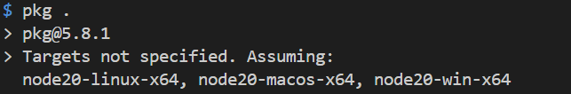
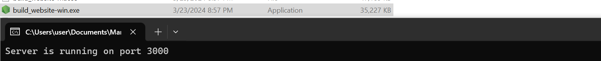
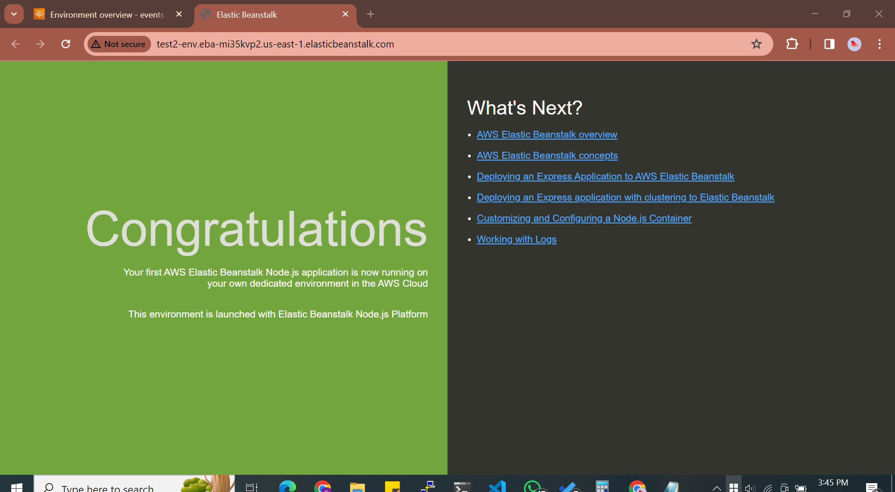
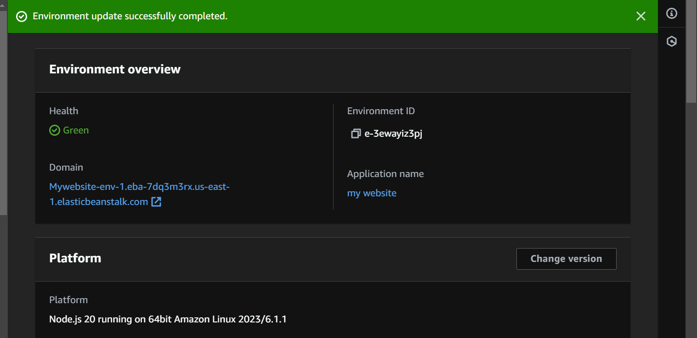
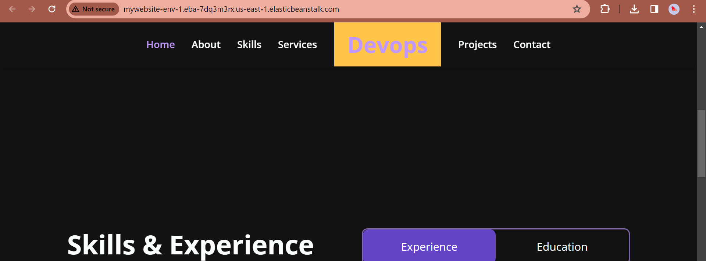

### SETTING UP AWS ELASTICBEANSTALK
Step 1: Prepare Your Website

* Ensure that your website is a web application or a collection of files (HTML, CSS, JavaScript, etc.) that you want to host. Organize your website files into a directory on your local machine.

* Step 2: Create an Elastic Beanstalk Application

Sign in to the AWS Management Console.
Navigate to the Elastic Beanstalk service.
Click on "Create Application".
Enter a name for your application.
Optionally, describe your application.
Click "Create".
* Step 3: Configure Your Environment

After creating the application, click on "Create Environment".
Choose the web server environment type.
Select the platform that matches your application (e.g., Node.js, Python, Ruby, PHP, Java, .NET, etc.).
Choose the appropriate application code deployment method (upload your code or use a version control system like Git).
Click "Create environment".

* Step 4: Upload Your Application Code

If you choose to upload your code during environment creation, you'll be prompted to upload your application code.
Upload the ZIP file or individual files containing your website code.
Optional, you can choose to use the S3 bucket if you already have this 
##### packaging  my files as an executable file for a nodejs platform
- To package your static website files into a standalone executable using a tool like pkg, you'll need to follow these general steps:

- Install Node.js and npm: If you haven't already, you'll need to install Node.js and npm (Node Package Manager) on your development machine. You can download and install Node.js from the official website: https://nodejs.org/

- Create Your Static Website Files: Ensure that your static website files (HTML, CSS, JavaScript, images, etc.) are organized and ready for packaging.

- Install a Web Server Package: Since your standalone executable will need to serve the static files, you'll need to include a web server in your package. One option is to use a lightweight Node.js web server package like http-server. Install it using npm:
```
npm install http-server
```
- Create Your Node.js Entry Point: Create a Node.js script that will serve your static files using the installed web server package. For example, you can create a file named server.js with the following content:
```
const httpServer = require('http-server');

const server = httpServer.createServer({
    root: './public' // Path to your static website files
});

const port = process.env.PORT || 3000; // Use the provided PORT or default to 3000

server.listen(port, () => {
    console.log(`Server is running on port ${port}`);
});

```

- Install pkg: Install the pkg package globally on your machine using npm
```
npm install -g pkg

```

- Package Your Application: Run pkg to package your Node.js script (server.js) along with the necessary dependencies into a standalone executable. Navigate to the directory containing your server.js file and run:
```
pkg .

```
if u run into this error

you can specify what target you need eg
```
pkg . --targets node14-linux-x64,node14-macos-x64,node14-win-x64
```
as at the time of writing this even tho i had v20 installed on my machine it keeps saying not found so i used v14
- Test Your Executable: Test the generated executable on your local machine to ensure that it serves your static website files correctly. Run the executable and access your website using a web browser.eg https://localhost:3000

it works !
Wait for the application to deploy.
* Step 5: Configure Environment Settings (Optional)

Configure environment settings such as instance type, capacity, environment variables, database connection strings, etc., as needed.
You can adjust these settings later from the Elastic Beanstalk console.
Step 6: Access Your Website

Once the environment is created and the application is deployed, you'll see a URL for accessing your website.
Click on the URL to open your website in a web browser and verify that it's working correctly.
You can also assign a custom domain to your Elastic Beanstalk environment if needed.

Step 7: Monitor and Manage Your Environment

Monitor your environment's health, performance, and resource utilization from the Elastic Beanstalk console. Scale your environment up or down as needed to handle changes in traffic or workload. Update your application code or environment configuration as needed.

### NOTE:IF THIS IS YOUR FIRST TIME USING AWSELASTICBEANSTALK 
Ebs usually creates  aws-elasticbeanstalk-ec2-role but due to aws security polices it no longer does this so you will have to create the role in your IAM manually 
if your AWS account doesn’t have an EC2 instance profile, you must create one using the IAM service. You can then assign the EC2 instance profile to the new environments that you create.

Follow this steps to do so:

- Open IAM Console 
- In the navigation pane of the console, choose Roles and then create role
- Under Trusted entity type, choose AWS service 
- Under Use case, choose EC2 
- Choose Next 
- Attach- :
  1. AWSElasticBeanstalkWebTier,
  2. AWSElasticBeanstalkWorkerTier
- Choose Next :Enter a name for the role - aws-elasticbeanstalk-ec2-role 
- Choose Create role.

If you already have an instance profile, make sure you have below-required policies. To meet the default use cases for an environment, these policies must be attached to the role for the EC2 instance profile:-

Role name: aws-elasticbeanstalk-ec2-role

Permission policies attached:-

AWSElasticBeanstalkWebTier
AWSElasticBeanstalkWorkerTier
AWSElasticBeanstalkMulticontainerDocker
```
Trust relationship policy for EC2:-

{
  "Version": "2008-10-17",
  "Statement": [
    {
      "Effect": "Allow",
      "Principal": {
        "Service": "ec2.amazonaws.com"
      },
      "Action": "sts:AssumeRole"
    }
  ]
}

```
sample application code


My website code 



#### Resources:

[CREATING EC2 INSTANCE PROFILE](https://stackoverflow.com/questions/30790666/error-with-not-existing-instance-profile-while-trying-to-get-a-django-project-ru/76620598#76620598)

[HANDS-ON MENTORSHIP BY CHISOM JUDE](https://github.com/genejike/Hands-on-Devops-Project/blob/master/Project-02/02%20-%20AWS/buildonaws.md)

[ELASTIC BEANSTALK IMPLEMENTATION ON YOUTUBE  ](https://www.youtube.com/watch?v=3h7PMHnilkM)

[AWS DOCUMENTATION](https://docs.aws.amazon.com/elasticbeanstalk/latest/dg/GettingStarted.CreateApp.html)
[Deploy Node JS application on AWS Elastic Beanstalk by chirag mehta](https://medium.com/@chiragmehta900/deploy-node-js-application-on-aws-elastic-beanstalk-dec0d420955a#:~:text=The%20first%20step%20is%20to,a%20name%20to%20your%20app.&text=Choose%20Managed%20platform%20in%20%22Platform%20type%22%2C%20and%20Node.)

[stackoverflow](https://stackoverflow.com/questions/68138996/nodejs-pkg-property-bin-does-not-exist-in-package-json?newreg=889b0e518ba64e7e8de3d286af144619)
[CHATGPT](https://chat.openai.com/share/7cfd4f2d-9bb6-461c-a589-a1af7e2f7f55)