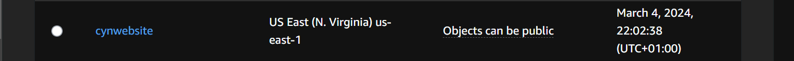
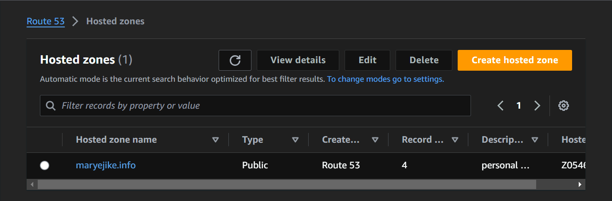
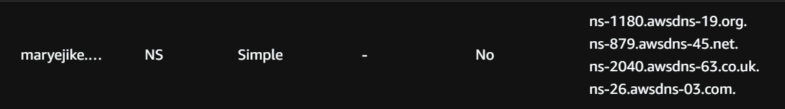
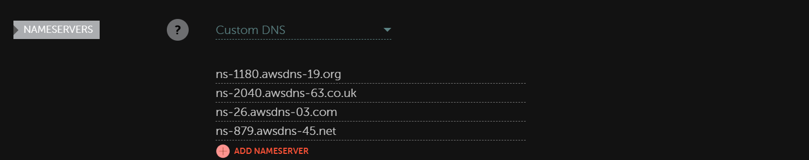
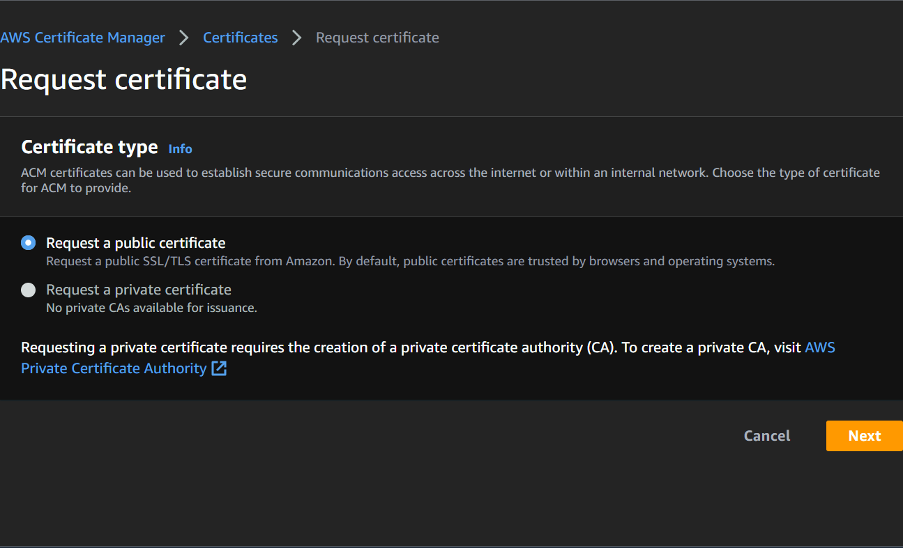
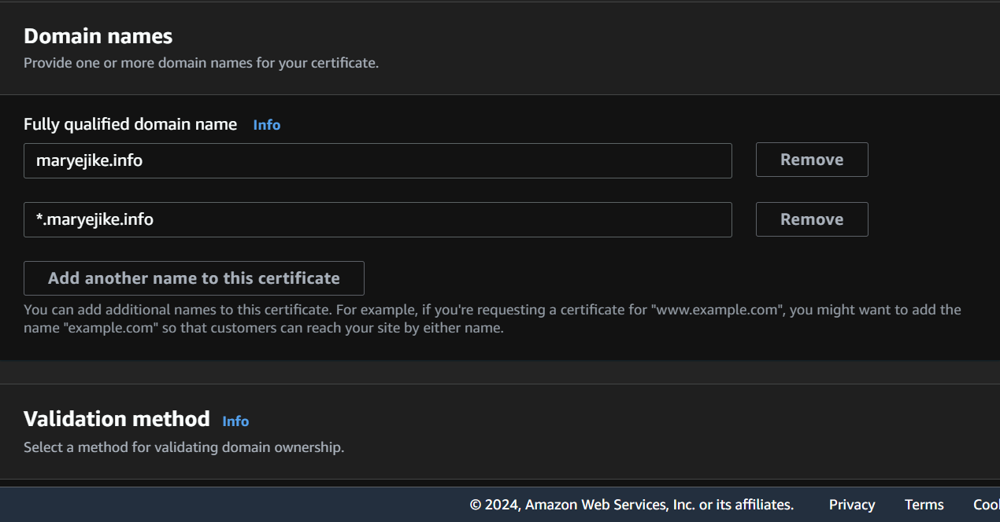
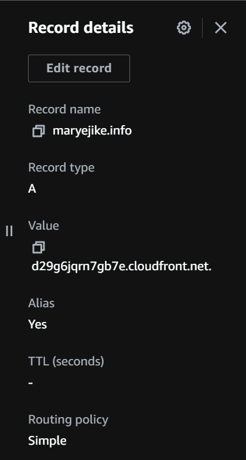
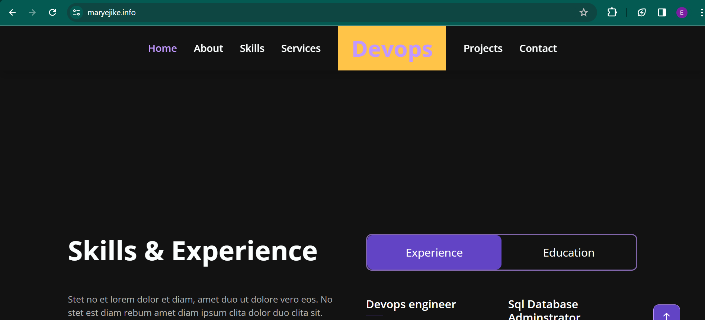

### HOST A STATIC WEBSITE
* Navigate to s3 from the aws management console .
* Type s3 from the find services and select s3 
* click on create bucket 
    * fill in your bucket name and preferred region
* click on create bucket 


* upload files to s3 bucket 

* click on add files and add folder button 
* Click "Add files" to upload the index.html file, and click "Add folder" to upload the css, img, and vendor folders.

### OR
*  use the aws configure to set the aws cli configuration 

```aws configure list
aws configure 
aws configure set aws_session_token "<TOKEN>" --profile default 
```
* upload the files
* Create a PUBLIC bucket in the S3, and verify locally as
```
aws s3api list-buckets 
```
* download the file 

```
aws s3api put-object --bucket <bucket-name> --key index.html --body index.html
```
* Copy over folders from local to S3 
eg.
```
aws s3 cp img/ s3://<bucket-name>/<file-name>/ --recursive
``` 
* go to the permissions tab
and make sure the bucket access allows public access for hosting


Edit bucket policy and add
```{
  "Version":"2012-10-17",
  "Statement":[
    {
      "Sid":"AddPerm",
      "Effect":"Allow",
      "Principal": "*",
      "Action":["s3:GetObject"],
      "Resource":["arn:aws:s3:::your-website/*"]
    }
  ]
}
```

* Go back to the properties tab and then scroll down to edit the static website hosting 
enable  the static website hosting 

### Distribution via cloud Front
* Go to cloud Front and create a distribution 

* Paste the Static website hosting endpoint of the form 
`.s3-website-region.amazonaws.com` for tha Origin > Domain Name field 

* use the defaults for the rest and create the distribution 

* you can access the webite via the cloud front domain name such as `d3bb7y5pgh8hll.cloudfront.net` when you paste it on the web browser
* add a bucketpolicy in s3 for your cloudfront distribution 

* All three links: CloudFront domain name, S3 object URL, and website-endpoint will show you the same `index.html` content.

### VIA ROUTE53 WITH CUSTOM DOMAIN NAME 

* Buy a domain name from any  domain registrer eg.godaddy,namecheap etc 
* Navigate to route53 and create a hosted zone.
* Enter your domain name in the “Domain Name” field and click on “Create hosted zone”.



* configure NS records in Namecheap, you need to copy the NS records from your hosted zone in Route 53 and update the DNS settings in your Namecheap account


## Aws certificate manager 
* Navigate to certificate manager
it is Important to select N. Virginia region(at the top of the header).





* Do either a dns validation and email validation . 
* in the domain section of the certificate manager click on create record in route 53 (the cname record is added to route 53 )

* Navigate back to route 53 and create an A record because we included the wildcard in the certificate request a www.domainname.com will work if not just do a domainname.com 


