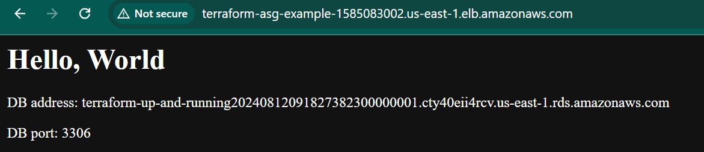

### creating tf state files and storing them on  s3 aws 
 - Never store state files in a VCS due to manual errors ,locking and the fact that terraform stores secrets in plain text inside the state files
- in your provider.tf file define the 
```h
terraform {
  required_providers {
    aws = {
      source = "hashicorp/aws"
      version = "5.62.0"
    }
  }
}
provider "aws" {
  # Configuration options
}
```
create your main.tf and add the s3 bucket 
```h
resource "aws_s3_bucket" "terraform_state" {
  bucket = "terraform-${random_string.bucket_id.result}" #create a unique bucket name 
  
}

resource "random_string" "bucket_id" {
  length  = 5
  special = false
}

### life-cycle configuration
resource "aws_s3_bucket_lifecycle_configuration" "bucklifecycle" {
  bucket = aws_s3_bucket.terraform_state.bucket

  rule {
    id = "rule-1"

    # ... other transition/expiration actions ...
     noncurrent_version_expiration {
      noncurrent_days = 2
    }
    status = "Enabled"
  }


```
- enable versioning on the bucket
```h
# Enable versioning so you can see the full revision history of your
# state files
resource "aws_s3_bucket_versioning" "enabled" {
  bucket = aws_s3_bucket.terraform_state.id
  versioning_configuration {
    status = "Enabled"
  }
}
```
- Turn on server side encryption by default 
```h
resource "aws_s3_bucket_server_side_encryption_configuration" "default" {
  bucket = aws_s3_bucket.terraform_state.id
  rule {
    apply_server_side_encryption_by_default {
      sse_algorithm = "AES256"
    }

  }
}

```
- block all public access to the bucket 
```h
resource "aws_s3_bucket_public_access_block" "public_access" {
   bucket = aws_s3_bucket.terraform_state.id
   block_public_acls = true
   block_public_policy = true
   ignore_public_acls = true
   restrict_public_buckets = true
}
```
- create a dynamodb table to use for locing that has a primary key LockID

```h

resource "aws_dynamodb_table" "terraform_locks" {
    name = "terraform-locks"
    billing_mode = "PAY_PER_REQUEST"
    hash_key = "LockID"

    attribute {
      name = "LockID"
      type = "S"
    }
  
}
```
- Run terraform init to download the provider code then run terraform apply 
- this will create the s3 bucket and dynamodb table but the code is still stored locally 
- Now to make terraform to store the state files in s3 with encryption and locking we have to add the backend configuration. 
- define the backend block inside the terraform block 
```h
terraform {
  backend "s3" {
    # Replace this with your bucket name!
    bucket         = "terraform-up-and-running-state"
    key            = "global/s3/terraform.tfstate"
    region         = "us-east-2"

    # Replace this with your DynamoDB table name!
    dynamodb_table = "terraform-up-and-running-locks"
    encrypt        = true
  }
}
```
- Run terraform init again so terraform can use the backend s3 . type yes 
- create an output.tf and define the bucket arn and dynamodb table name 
```h
output "s3_bucket_arn" {
  value       = aws_s3_bucket.terraform_state.arn
  description = "The ARN of the S3 bucket"
}

output "dynamodb_table_name" {
  value       = aws_dynamodb_table.terraform_locks.name
  description = "The name of the DynamoDB table"
}
```
- run terraform apply to see the output 
- now notice that the s3 bucket and dynamodb tables where created first  with the local backend before the backend configuration was added and terraform init was run again 
- to delete it you have to remove the backend configuration block rerun teraform init then run terraform destroy 
- **NOTE** You cant use variable references in backend block it wunt work you have to write manually 
- You can reduce the manual input by creating a file named backend.hcl and putting the parameters inside except the `key` parameter that defines where you want to put the files  
```
# backend.hcl
bucket         = "terraform-up-and-running-state"
region         = "us-east-2"
dynamodb_table = "terraform-up-and-running-locks"
encrypt        = true
``` 
- so when running your terraform init it will be 

```h
terraform init -backend-config=backend.hcl

```
- or use terragrunt

### state File isolation 
- Isolate state files for dev , stage and prod in a seperate set of configuration 
2 ways 
- isolation by workspaces
- isolation via file layout 
#### isolation via  workspaces

- create another folder inside this folder and name it ec2 instance 
- create a main.tf ,provider.tf file
- terraform workspaces allows to store in multiple seperate named workspaces 
- the default workspace is what terraform starts with if u dont specify it will use the default 
- terraform workpace commands help you switch between workspaces 
in main.tf define the 

```h
resource "aws_instance" "example" {
  ami           = "ami-0fb653ca2d3k77g7"
  instance_type = "t2.micro"
}
``` 
in the providers.tf

```h
terraform {
  required_providers {
    aws = {
      source = "hashicorp/aws"
      version = "5.62.0"
    }
  }
 # Replace this with your bucket name!
  # Replace this with your DynamoDB table name!
  backend "s3" {
    key = "workspaces-example/terraform.tfstate"
    bucket = "b"
    region = "us-east-1"
    dynamodb_table = "t"
    encrypt = true
    
    
  }
}
provider "aws" {
    region = "us-east-1"
  
}
```
- run `terraform init` and `terraform apply ` 
- type `terraform workspace show `
- To create a new workspace  and switch run `teraform workspace new <nameofworkspace>`
- run `terraform plan` and `terraform apply` it will deploy a total new instance
- you can create a new workspace to test it again 
-`terraform workspace list` to see all workspaces 
- `terraform workspace select <nameofworkspace>` to switch inbetween them 
- verify this from your s3 bucket
- tenary syntax to conditionally set workspaces depending on the value 
```h
resource "aws_instance" "example" {
  ami           = "ami-0fb653ca2d3203ac1"
  instance_type = terraform.workspace == "default" ? "t2.medium" : "t2.micro"
}
``` 
- drawbacks
* state files in the same backend you have to use same authentication for all workspaces so it is not suitable
* have to run terraform workspace to see where your at
* running terraform destroy on a workspace , you can be on production and forget your on production and delete it imagine 

- using folders is better seperate folders for dev staging and prod env
- seperate components like Vpc , services ,db etc


#### isolation by layout 
- for each environment put them in seperate folders env ,stage,prod
- configure different backends for each environment
- for each componenets such as db , VPC, services use different folders
- global folders are where you put resourses used across all env
- service folder for apps or microservices
- always use a predictable and consistent naming so your code is easier to browse
-  arrange your file structure like the imagge above 
- put your s3 and dynamodb in your global-files folder
- create a staging folder , create a service folder and put your cluster of webservers folder in it 
##### drawbacks
- you can no longer use one command to run your infra cause they in multiple folders now 
- a lot of duplication for stage and prod solution is to use terraform modules
- you cant use resource dependencies because of they live in different folders now
so u either use dependency blocks or terraform_remote_state .
- the remote_state is used to fetch the terraform state file stored by another set of configuration
##### terraform_remote_state
- create a new folder in the stage folder named data-stores
- create a folder for mysql create your .tf files

```h
provider "aws" {
  region = "us-east-2"
}

resource "aws_db_instance" "example" {
  identifier_prefix   = "terraform-up-and-running"
  engine              = "mysql"
  allocated_storage   = 10
  instance_class      = "db.t2.micro"
  skip_final_snapshot = true
  db_name             = "example_database"

  # How should we set the username and password?
  username = "???"
  password = "???"
}
``` 
- in your variables.tf
```h
variable "db_username" {
  description = "The username for the database"
  type        = string
  sensitive   = true
}

variable "db_password" {
  description = "The password for the database"
  type        = string
  sensitive   = true
}
```
- the variables are marked with sensitive = true so terraform wunt log them 
now pass the username and password as 
```h
{
username = var.db_username
password = var.db_password
}
```

- set up the backend to use s3 as the backend 

```h
terraform {
  backend "s3" {
    # Replace this with your bucket name!
    bucket         = "terraform-up-and-running-state"
    key            = "stage/data-stores/mysql/terraform.tfstate"
    region         = "us-east-2"

    # Replace this with your DynamoDB table name!
    dynamodb_table = "terraform-up-and-running-locks"
    encrypt        = true
  }
}
```
- add the outputs.tf 

```h
output "address" {
  value       = aws_db_instance.example.address
  description = "Connect to the database at this endpoint"
}

output "port" {
  value       = aws_db_instance.example.port
  description = "The port the database is listening on"
}
```
- pass the env values in your terminal 

```h
$ export TF_VAR_db_username="(YOUR_DB_USERNAME)"
$ export TF_VAR_db_password="(YOUR_DB_PASSWORD)"
``` 
- run terraform apply 
- the state files are stored in stage/datastores/mysql/terraform.tfstate
- you can check to confirm 
##### Applying the terraform_remote_state 
###### Connecting the rds database to the webserver
- if you  to your stage/services/webcluster/main_ec2.tf file you can get your webserver to read the output from the database files by adding the resources block 
```h
data "terraform_remote_state" "db" {
  backend = "s3"

  config = {
    bucket = "(YOUR_BUCKET_NAME)"
    key    = "stage/data-stores/mysql/terraform.tfstate"
    region = "us-east-2"
  }
}
```
that way the webserver cluster reads the state file from the same s3 bucket and folder where the database stores it state and the data read my terraform_remote_state is read only 
- i can now reference it with `data.terraform_remote_state.<NAME>.outputs.<Attribute>`
- you can update the userdata section of your webserver in the aws_launch_configuration section to 
```h
user_data = <<EOF
#!/bin/bash
echo "Hello, World" >> index.html
echo "${data.terraform_remote_state.db.outputs.address}" >> index.html
echo "${data.terraform_remote_state.db.outputs.port}" >> index.html
nohup busybox httpd -f -p ${var.server_port} &
EOF
```  
- using inline userdata scripts can be messy tho imagine having pages of scripts
- To solve that we use templatefile built in fuction so we can externalize the bash scripts
- terraform has a lot of built in functions to experiment with them use the` terraform console` command, this is a read only too it wunt accidentally change the infrastructure  . Google them to find more about them 
- create a user_data.sh file and input the this
```sh
#!/bin/bash

cat > index.html <<EOF
<h1>Hello, World</h1>
<p>DB address: ${db_address}</p>
<p>DB port: ${db_port}</p>
EOF

nohup busybox httpd -f -p ${server_port} &
```

- update your aws_launch_configuration to
```h
resource "aws_launch_configuration" "example" {
  image_id        = "ami-0fb653ca2d3203ac1"
  instance_type   = "t2.micro"
  security_groups = [aws_security_group.instance.id]

  # Render the User Data script as a template
  user_data = templatefile("user-data.sh", {
    server_port = var.server_port
    db_address  = data.terraform_remote_state.db.outputs.address
    db_port     = data.terraform_remote_state.db.outputs.port
  })

  # Required when using a launch configuration with an auto scaling group.
  lifecycle {
    create_before_destroy = true
  }
}
```

- run the terraform apply command 


- it is important to understand the isolation and locking and the tf state because in IACs anhy small mistake can break things .


