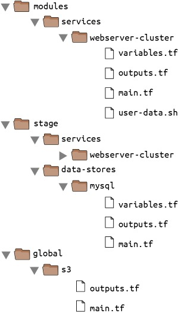

### Terraform modules 
- Modules help to reduce repetition ,encourages reusability and maintain testable terraform code 
- lets create environments for staging and prod 
- and ensure they use the same modules without copying and pasting 
#### Module basics
- A module is a set of configuration files
- when you run apply directly on a module it is refered to as the root module but you need to create a reusable module that can be used by other modules 
- run terraform destroy on the */stage/services/webservercluster* to clear previously created infrastructure
- Remove the provider definition from the main.tf file or if u configured it in provider.tf remove it as the provider definition should only be configured in the the root modules and not reusable modules 

- as you have moved everything you created into the module folder your *stage/services/webservercluster* folder is now empty create a new main.tf file ,now we get to use the webserver-cluster module
```h
provider "aws" {
  region = "us-east-1"
}

module "webserver_cluster" {
  source = "../../../modules/services/webserver-cluster"
}
```
- do the same for your *prod/services/webserver-cluster/main.tf*
- back the webservercluster staging environ , run the terraform init command 
- this command configures the backend and download the new module
- now in our webserver cluster most of the names are hardcoded lets go change that as it will cost a lot of name conflicts in the aws account if run more than once the solution is to add configurable inputs to the webserver-cluster .
#### Module inputs
- using what we know about the variables definition 
- open the *modules/services/webserver-cluster/variables.tf* and add the following 
```h
variable "cluster_name" {
  description = "The name to use for all the cluster resources"
  type        = string
}

variable "db_remote_state_bucket" {
  description = "The name of the S3 bucket for the database's remote state"
  type        = string
}

variable "db_remote_state_key" {
  description = "The path for the database's remote state in S3"
  type        = string
}
```
- go bck to the *modules/services/webserver-cluster/main.tf* so we can use the 
var.clustername e.g
```h
resource "aws_security_group" "terraformer-instance" {
  name        = "${var.cluster_name}-terraformer-instance"
  description = "Allow terraformer-instance inbound traffic and all outbound traffic"
  vpc_id = data.aws_vpc.default.id

  tags = {
    Name = "terraformer-instance"
  }
}
```
- repeat the same name parameter change for the aws_security_group, the aws_alb resource, and the tag section of the auto_scaling group 

- in the terraform_remote_state do the same so its bucket and key parameter replace them with 
```h
data "terraform_remote_state" "rdsexample" {
  backend = "s3"

  config = {
    bucket = var.db_remote_state_bucket
    key    =var.db_remote_state_key
    region = "us-east-1"
  }
}
```
- in the staging env , in *stage/services/webserver-cluster/main.tf* include values defined in the modules variable.tf in your module block
```h
module "webserver_cluster" {
  source = "../../../modules/services/webserver-cluster"

  cluster_name           = "(cluster-name)"
  db_remote_state_bucket = "(YOUR_BUCKET_NAME)"
  db_remote_state_key    = "stage/data-stores/mysql/terraform.tfstate"
}
``` 
- do the same in your prod environment 
- in the webserver section of the modules folder inside the variable.tf file creater input variables for inatance type ,min-size and max_size
```h
variable "instance_type" {
  description = "The type of EC2 Instances to run (e.g. t2.micro)"
  type        = string
}

variable "min_size" {
  description = "The minimum number of EC2 Instances in the ASG"
  type        = number
}

variable "max_size" {
  description = "The maximum number of EC2 Instances in the ASG"
  type        = number
}
```
- in your autoscaling section and launch configuration section of the modules folder 
anywhere you see instance type change it to var.instancetype
- repeat same for min_size and max_size
- define them in your staging environment 
```h
module "webserver_cluster" {
  source = "../../../modules/services/webserver-cluster"

  cluster_name           = "webservers-stage"
  db_remote_state_bucket = "(YOUR_BUCKET_NAME)"
  db_remote_state_key    = "stage/data-stores/mysql/terraform.tfstate"

  instance_type = "t2.micro"
  min_size      = 2
  max_size      = 2
}
``` 
- for prod you can do pick larger instance_type and increase your min_size and max_size
#### Module locals
- this is use to define variables that you do not want displayed as a configuration input eg the from_port,to_port,protocol,cidr_blocks section of yor ingress and egress rules 
- if they are hardcoded in different areas it makes the code difficult to read and users of the module can accidently overide them so instead of the input variable you can use the local block
```h
locals {
  http_port    = 80
  any_port     = 0
  any_protocol = "-1"
  tcp_protocol = "tcp"
  all_ips      = ["0.0.0.0/0"]
}
```
- so you cant override this from outside a module 
- now update this refferences where applicable using eg. local.anyport inplace of 0 
- i created a local.tf and defined them there 
```h
resource "aws_vpc_security_group_ingress_rule" "terraformer-instance" {
  security_group_id = aws_security_group.terraformer-instance.id
  cidr_ipv4         = local.any_port
  from_port         = local.https_port
  ip_protocol       = local.https_ip_protocol
  to_port           = local.https_port
}
``` 
- repeat for all ingress and egress rules that you have defined 
#### Module outputs
- a module returns values specified in the output,tf 
```h
output "asg_name" {
  value       = aws_autoscaling_group.example.name
  description = "The name of the Auto Scaling Group"
}
```
- and u can reference them as well as seen below 
`module.<module_name>.<output_name>`
- Use can use scheduled action to increase or decrease the number of servers sing eg cron syntax "0 9 * * *"
```h
resource "aws_autoscaling_schedule" "scale_out_during_business_hours" {
  scheduled_action_name = "scale-out-during-business-hours"
  min_size              = 2
  max_size              = 10
  desired_capacity      = 10
  recurrence            = "0 9 * * *"

  autoscaling_group_name = module.<cluster_name>.asg_name
}
```
- or by using the syntax in terraform docs
[auto_asg_scheduling](https://registry.terraform.io/providers/hashicorp/aws/latest/docs/resources/autoscaling_schedule)
```h
resource "aws_autoscaling_schedule" "foobar" {
  scheduled_action_name  = "foobar"
  min_size               = 0
  max_size               = 1
  desired_capacity       = 0
  start_time             = "2016-12-11T18:00:00Z"
  end_time               = "2016-12-12T06:00:00Z"
  autoscaling_group_name = aws_autoscaling_group.foobar.name
}
```
#### Module gotchas
- remeber when we defined the templatefile function in our launch configuration ,in reusable modules that wunt work because the reusable module folder can completely reside in another computer to sole this we can use the path references:
"
- path.module
Returns the filesystem path of the module where the expression is defined.

- path.root
Returns the filesystem path of the root module.

- path.cwd
Returns the filesystem path of the current working directory. In normal use of Terraform, this is the same as path.root, but some advanced uses of Terraform run it from a directory other than the root module directory, causing these paths to be different.
" gotten for Terraform:up and running chp4;module gotchas
- now go back to the user_data section of your launch_configuration and edit accordingly 
```h
  user_data = templatefile("${path.module}/user-data.sh", {
    server_port = var.server_port
    db_address  = data.terraform_remote_state.db.outputs.address
    db_port     = data.terraform_remote_state.db.outputs.port
  })
```
- for the ingress and egress section  use thier resources block of ""aws_vpc_security_group_ingress_rule" ,""aws_vpc_security_group_ingress_rule" instead of using the specifying them as inline blocks
- add the security group id as an output variable so you can refrence them when creating modules that require other ports being open 
```h
output "alb_security_group_id" {
  value       = aws_security_group.alb.id
  description = "The ID of the Security Group attached to the load balancer"
}
```
eg if you want to open another ingress port 
add the 
```h
resource "aws_vpc_security_group_ingress_rule" "terraformer-instance" {
  security_group_id = module.webserver_cluster alb_security_group.id
  cidr_ipv4         = ["0.0.0.0/0"]
  from_port         = 5056
  ip_protocol       = "tcp"
  to_port           = 5056
}

```
- In the real world always create a seperate vpc for all your environments 
Reasons:
- if all your infra is on the same network one mistake in the vpc configurations can affect them all
- if an external body has access to that vpc automatically it has access to all your infra eg stage and prod 
- do not define aws_security_group ,aws_vpc_security_group_ingress_rule,aws_vpc_security_group_egress_rule,aws_route_table , aws_route,aws_network_acl , aws_network_acl_rule as inline blocks
#### Module versioning 

- if your using the same modules for both staging and prod if you make changes to it it will affect them both 
solution: create a versioned module eg 0.0.1 for prod and 0.0.2 for staging 
- now put the modules folder in a new repository seperate from the one we are working from add ,commit and do a git tag and create a release 
```
$ git tag -a "v0.0.1" -m "first release"
$ git push --follow-tags
```
- read up on semantic versioning to understand more about the vMAJOR.MINOR.PATCH
- while the staging and prod folders we have ,create a new folder named live and put the folders inside 
-  inside the main.tf file in my staging env of my webcluster 
edit the source like to be `"git::https://github.com/username/reponame.git//path/to/module?ref=v0.0.1"`
- this will only work if your repo is public tho, if it is private you whould have to include the username and token for authentication or use a user that is authorized to do so 
- for private repositories it is better to use  ssh to autenticate and let the user use   `ssh agent` to generate a key file while you add the public key file to the ssh and gpg key section of github this way terraform autenticates faster 
- version modules are great for shared environments , if its just you u can use local file paths 
