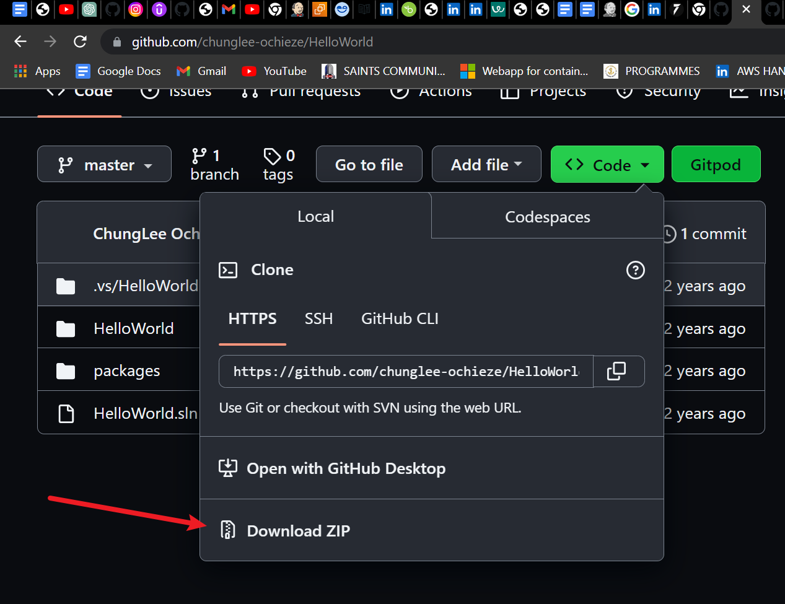
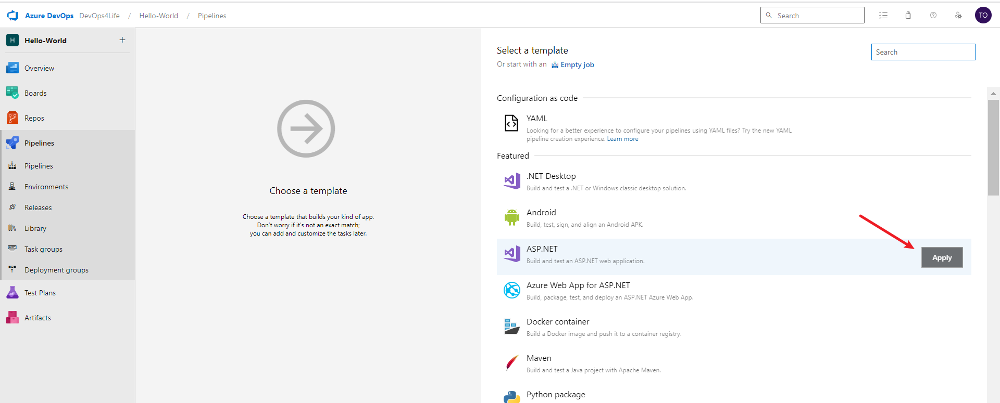

## Business Case Study: Implementation of CI-CD for Hello World 

Myworks.xyz is a leading commercial bank in Nigeria with a strong reputation for service excellence, alternative delivery channel platform, strong corporate governance, top of the range IT infrastructure, and wide network expansion. The company has a presence in Africa, the UAE, China, USA, and the United Kingdom. The company has about 12,000 users using the Core business system and about 790 branches across the country.

The company has identified an issue around it’s solution delivery process and time-to-market and has commenced the adoption of Agile DevOps to address this issue. You have been hired as an Analyst, DevOps automation and your job include the setting up of CI-CD pipelines for upcoming projects. Details of your immediate task is as below 

1.	Download the code for “Hello World” solution from https://github.com/chunglee-ochieze/HelloWorld
2.	Working on Azure DevOps, create a Git repository and check in the code 
3.	Create and run an Azure Build Pipeline for the solution 
4.	Create an Azure app service for the solution 
5.	Create and run an Azure Release pipeline for the solution
6.	Confirm your deployment by browsing the app service URL

# Task 1

- I downloaded the zip file of the code 

- upziped it and pasted the code into a new folder and opened the folder using Visual Studio Code 

# Task 2. Working on Azure DevOps, create a Git repository and check in the code 
First thing is to create a project in AzureDevops 
 
 - I named mine `Hello-World

 - I selected agile beacause the company has commenced the adoption of Agile DevOps to address it's solution delivery process and time-to-market

- Navigate to repo then to files

- Copy the code under Push an existing repository from command line 

- refresh the webpage and we see the code 

# Task 3. Create and run an Azure Build Pipeline for the solution 

- Go to pipeline

I added Sonar cloud plugin to the organistaion
I then went to https://www.sonarsource.com/products/sonarcloud/ to handle configurations 

SonarCloud performs static code analysis, identifying potential bugs, vulnerabilities, and code smells, allowing you to address them early in the development process. By integrating SonarCloud into your CI/CD pipeline, you can ensure that your code meets industry standards and best practices, ultimately improving the overall quality and security of your software.
- get a PAT token for the sonarcloud intergation 

- Intergtrated a service connection with sonarcloud  

- Let's build and add sonar cloud to othe agent job

- set the jobs up

- using sonacloud to recieve summary report of the above the code technical debts 

# Task 4. Create an Azure app service for the solution 

using the auzre portal i created:

- A resource group
- An app service plan

Then i created a Dotnet Webapp

# Task 5 Create and run an Azure Release pipeline for the solution

- Go to release

- New pipeline

- Select azure app service deployment

- Configure Development environment task

- Add artiact and enable continous intergration trigger

- Create QA and Production app services

- Upgrade pricing to have access to some feature such as deployment slot 

- create a staging production environment

- My Azure devop project and go to release pipeline

- set QA task

 
- I enabled pre-deployment approval 

- Production site before swaping with staging env slot

- Setup Production staging environment  

.png)

- We need to swap stagingenv with Production

  - 

  Select Source and target then swap
  - 
  - 

## Our swap was sucessful let's see if it's up nd running in production server 

# UP AND RUNNING

